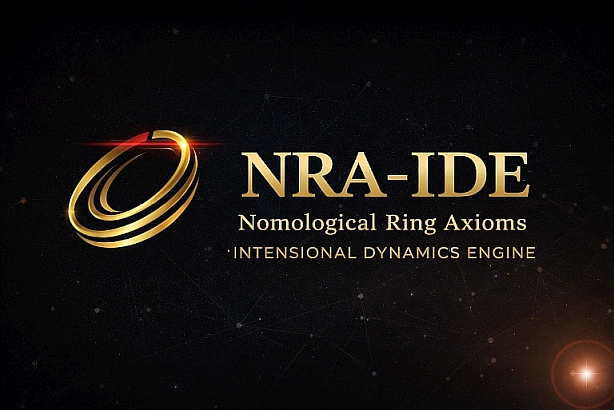

# NRA‑IDE: Nomological Ring Axioms – Intensional Dynamics Engine
### **律環公理 – 内包性動力学エンジン**

  

---

## 📄 Documents

| File | Description |
|------|-------------|
| [FORMULA.md](./FORMULA.md) | Fundamental equations — R = δ/τ and Dual-Fluctuation Formula |
| [THEORY.md](./theory/THEORY.md) | Core axiom and structural worldview |
| [Foundational_Thesis.md](./theory/Foundational_Thesis.md) | Full theoretical paper (JP + EN) |
| [ETHICS.md](./theory/ETHICS.md) | Ethical statement |
| [axioms.json](./theory/axioms.json) | Machine-readable axiom definitions |
| [SANDWICH_ARCH.md](./theory/SANDWICH_ARCH.md) | Box Sandwich Architecture — structural isolation spec for LLM integration |
|  [GOVERNANCE.md](./GOVERNANCE.md) the project's design philosophy and intent regarding derivatives.
---

## 🌏 For Japanese Speakers

**日本語版ドキュメントは [README_JP.md](./README_JP.md) をご覧ください。**

---

## Core Axiom

## "Existence is Generation."

This framework does not treat existence as a fixed entity.
**Existence appears as "state transition."**

Here, "generation" does not imply creation from nothing, but refers to the manifestation of existence through the process of state transition.

---

## Fundamental Structure: Redefining Time and Distance

Instead of relying on linear computation (continuity, distance, meaning), this system describes the world through physical and structural constraints.

1. **Time**
   - Time is not treated as an independent "causal variable."
   - Time is described as the **ordering of state transitions**.

2. **Distance**
   - Distance is not treated as a "causal driver."
   - Distance is recorded as an **observational result** of state change.

3. **Tension**
   - Refers to the **restoring tendency** arising from constraint boundaries.
   - It is treated as a structural constraint, which may manifest as physical tension.

---

## What Is NRA‑IDE?

**NRA‑IDE is NOT an "Integrated Development Environment."**
**It is an "Intensional Dynamics Engine" that implements the Nomological Ring Axioms.**

- **No Meaning Generation**: The IDE does not generate "meaning"; it evaluates structural states.
- **Physical Explainability**: It calculates tension structures, threshold dynamics, and closed-world constraints in a physically explainable manner.

---

## Why NRA-IDE Does Not Accumulate Error

A mechanical clock keeps accurate time not because its gears are perfect, but because its
**escapement mechanism advances in discrete, complete steps** — no fractional remainder carries forward.

NRA-IDE applies this same principle. Rather than processing state transitions as continuous floating-point values,
the IDE operates on **integer phase locks**. Each step is structurally complete. There is no residual to inherit.

---

## Structural Ratio & Threshold System

Unlike conventional black-box AI, this system uses **Thresholds** to make decision grounds physically explainable.

$$
\displaystyle R = \frac{\delta}{\tau}
$$

- **δ (delta)**: Deviation from constraints (fluctuation/displacement)
- **τ (tau)**: Tolerance boundary (thickness of tension)
- **R**: Structural Ratio

---

## 📜 License

This project is provided under the **MIT License**.

- Free to use, modify, and distribute for research, personal, and commercial purposes.
- Attribution is required in all redistributed materials.
Copyright (c) 2026 M‑Tokuni

See **[LICENSE](./LICENSE)** for full terms.

---

  <strong>Status: Lighthouse</strong>

---

