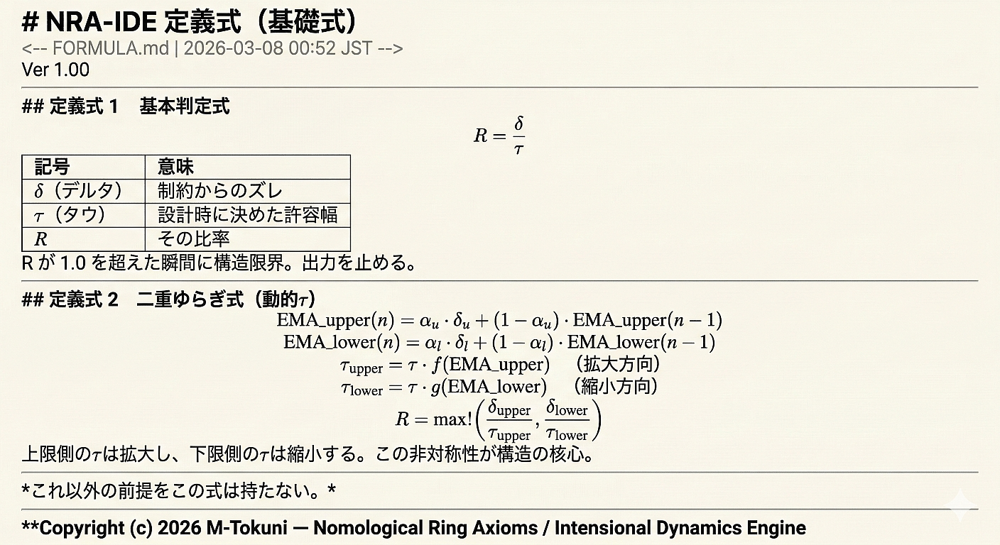

# NRA-IDE

## 律環公理 — 内包性動力学エンジン
### Nomological Ring Axioms (NRA) - Intensional Dynamics Engine (IDE)

---

## Project Structure

The documents in this directory explain the structure of NRA-IDE.

- `en-US/ai/` : English technical documentation
- `ja-JP/ai/` : Japanese technical documentation
- `figures/` : conceptual diagrams and demonstration models

These materials describe the structural principles of NRA-IDE, including causal isolation, threshold dynamics, and fail-closed behavior.

---

## Axiom

Existence is generation.
Every dynamic system contains a threshold.
Within the structure of the world, no true static state exists.

This framework does not reject existing academic disciplines; rather, it presents a new perspective grounded in differences of framing and observational span.

---

## Core Concept

## “By establishing the Quantum IDE as the fundamental layer, the architecture ensures that classical computation is employed only in a supplementary manner and strictly within the domain where error divergence cannot occur.”

---

## “By establishing the Quantum IDE as the fundamental layer, the architecture ensures that classical computation is employed only in a supplementary manner and strictly within the domain where error divergence cannot occur.”

---

## Architecture

---

### Copyright (c) 2026 M-Tokuni
### SPDX-License-Identifier: MIT
