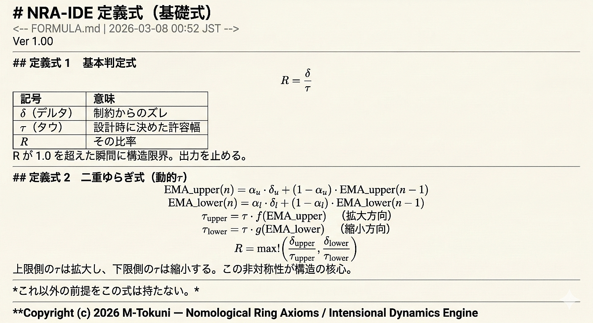
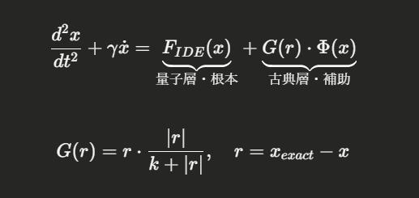

# NRA-IDE: 線形近似の限界と、非線形な「構造的境界」の再定義

## 律環公理 — 内包性動力学エンジン  
### Nomological Ring Axioms (NRA) - Intensional Dynamics Engine (IDE)

---

> 「最適化の極致において、系は不可逆な破断（R=1.0）へと収束する」

現代の安全設計の多くは、一つの重要な構造的見落としを抱えています。それは、「効率」の向上や「予測」の精密化が、必ずしもシステムの堅牢性に直結しないという事実です。むしろ、特定の境界条件下では、これらの努力が系の「残渣（Residue）」を削り取り、微小な変動に対していかにも脆弱な構造を作り出してしまうことがあります。

線形的な安全設計は、境界（Boundary）を固定的なものと見なし、残渣（Residue）を「制御可能な誤差」として扱うことで成立しています。しかし、NRA-IDE（律環公理）は、この切り捨てられた残渣こそが系の真の安定性を支配する主役であると定義します。システムの「誠実な沈黙」によって安全を担保する、新しい知のパラダイムを提示します。

---

## インタラクティブ・体験モジュール (M1〜M5)

既存の線形近似がどのような条件下で限界を迎えるのか、そしてNRAが何を「観測」しているのかを、以下のデモで体感してください。

1. **[M1: 線形 vs NRA 破断対比](./figures/M1_NRA_linear_breakdown_simulator.html)**
   - 線形近似が「想定外の変動」に直面した際の挙動の差異を確認してください。
2. **[M2: 残渣タンク (Residue Tank)](./figures/M2_NRA_residue_tank.html)**
   - システム内部に蓄積する「残渣」の減少と、臨界接近時の感度上昇を体験してください。
3. **[M3: 生体模倣サンドイッチ (Biomimetic Sandwich)](./figures/M3_NRA_biomimetic_sandwich_svg.html)**
   - 多層防御がなぜ「異なる時間スケールの管理」に基づくべきかを視覚的に理解します。
4. **[M4: 告白デバッガー (Confession Debugger)](./figures/M4_NRA_confession_debugger.html)**
   - AIが「なぜ答えないのか」という理由を構造的に示す、誠実な沈黙の論理。
5. **[M5: 用語集フリップカード](./figures/M5_NRA_IDE_flip_glossary.html)**
   - NRAの世界観を支える、再定義された言語群を確認します。

---

## 根本公理: $R = \delta / \tau$

NRA-IDEのすべては、この一式に収束します。

- **$\delta$ (Delta):** 未知の変位、あるいは既存の論理からの逸脱。
- **$\tau$ (Tau):** システムが許容できる時間の幅、あるいは構造的な余裕。
- **$R$ (Residue):** 残渣。$R \ge 1.0$ となったとき、システムは「正しく失敗（Fail-Closed）」し、出力を停止します。

このドキュメントを読み終えた時、あなたの安全に対する定義は、もはや後戻りできないほどに書き換わっているでしょう。

---

## プロジェクト構造

- `ja-JP/ai/` : 日本語による深淵な技術解説  
- `Sandwich-ARCHITECTURE.md` : 異なる時間スケールを統御する設計思想  
- `figures/` : 概念図およびデモンストレーションモデル  

---

### Copyright (c) 2026 M-Tokuni  
### SPDX-License-Identifier: MIT
