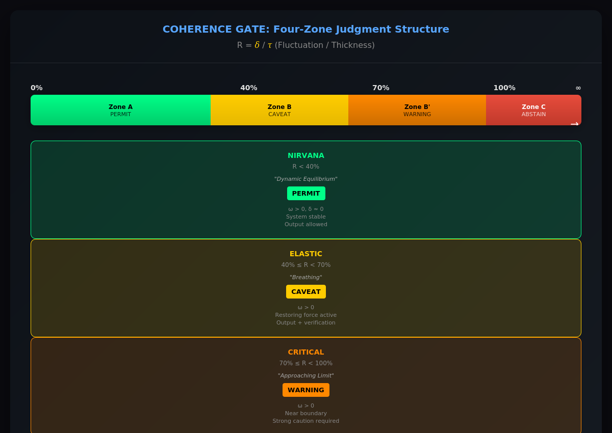

# 05 Coherence Gate — Structural State Classification

<!-- FILE: 05_coherence_gate_EN.md -->

---

## Why classification is necessary

In the previous chapters, we introduced two fundamental quantities:

* **δ (fluctuation)** — the instantaneous amplitude of structural deviation

* **τ (structural thickness)** — the structural margin available at the boundary

From these two quantities we derived the ratio

```text

R = δ / τ

```

R indicates how close a structure is to its boundary.

However, a single numerical value is not always intuitive during operation.

For this reason, NRA-IDE introduces a **structural classification mechanism**.

This mechanism is called the **Coherence Gate**.

---

## Four structural states

The Coherence Gate divides the structural state into four categories.

These states are determined entirely by the ratio **R**.

---

### NIRVANA

```text

R ≈ 0

```

Fluctuation is extremely small compared with the available structural thickness.

The system is operating far from its boundary.

This state represents **maximum structural stability**.

---

### ELASTIC

```text

0 < R < R₁

```

Fluctuation exists but remains comfortably within the structural margin.

The structure responds elastically and returns to equilibrium.

Most normal operation occurs within this region.

---

### CRITICAL

```text

R₁ ≤ R < Rop

```

Fluctuation is approaching the structural boundary.

The system is still operating, but the margin is shrinking.

At this stage, careful monitoring becomes important.

If fluctuation continues to grow, the system will soon reach the operational limit.

---

### SILENCE

```text

R ≥ Rop

```

The operational boundary has been exceeded.

At this point the system does **not attempt to continue computation**.

Instead, the system stops producing output.

Control is transferred to the next responsible agent.

This behavior is known as **Fail-Closed**.

---

## Why the state is called “coherence”

The term **coherence** refers to the structural integrity of the system.

When fluctuation remains within the available structural thickness,

the structure maintains coherence.

When fluctuation approaches or exceeds the boundary, coherence collapses.

The gate therefore monitors the coherence of the system.

---

## Structural advantages

The Coherence Gate has several important properties.

First, it does not depend on semantic interpretation.

The gate evaluates only the structural relationship between δ and τ.

Second, it does not require prediction.

The gate evaluates the **present state**.

Third, it avoids optimization loops.

Because no score is being maximized, the system has no incentive to manipulate its own evaluation metric.

---

## Visualization

A conceptual diagram of the Coherence Gate can be seen here:



The diagram illustrates how the ratio **R** moves through the four structural regions.

---

## Transition to operational control

Once the structural state is classified, the system must decide what action to take.

When the boundary is exceeded, the system enters the **Fail-Closed** state.

The next chapter explains how this mechanism ensures safe delegation when structural limits are reached.
