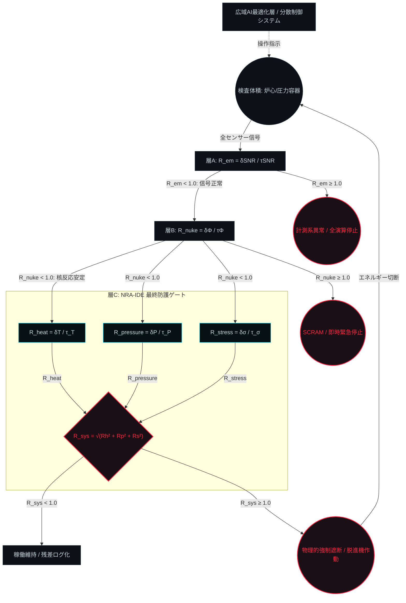

# NRA-IDE Multi-Physics Safety Gate Architecture

<!-- FILE: Multi-Physics_Safety_Gate_Architecture.md / 2026-03-06 21:44 -->

**バージョン:** 2.0.0  

**対象領域:** 原子力プラントなど / 多重物理連成系（Multi-Physics System）  

**位置づけ:** 本ファイルは基礎式・センサー定義・システムトポロジーの **Source of Truth** である。  

設計思想・層構造の根拠については `NRA-IDE_IPL_3Layer_Monitor.md` を参照すること。

---

## 1. アーキテクチャ基本思想 (Connection vs Mixing)

本アーキテクチャは以下の3層を完全に分離する。

| 層 | 名称 | 役割 |

|---|---|---|

| 層A | 電磁気的データ完全性保証 | センサー計測値の信頼性確認（前提条件） |

| 層B | 核反応動特性ゲート | 上流因果の監視・SCRAM判定（前段ゲート） |

| 層C | NRA-IDE 最終防護ゲート | 熱・圧力・応力の直交合成による構造限界判定 |

各層は他層の判定結果を参照しない。いずれかが $R \geq 1.0$ を検出した瞬間、独立してFail-Closedを発令する。

複数の物理次元（熱・圧力・応力）は途中で混同（Mixing）されず、それぞれ独立した無次元テンションベクトルとして計算された後、層Cの最終ゲートにおいてのみ直交合成（Connection）される。

---

## 2. 層A：電磁気的データ完全性保証

### 定義

$$R_{em} = \frac{\delta_{SNR}}{\tau_{SNR}}$$

| 変数 | 定義 |

|---|---|

| $\delta_{SNR}$ | センサー信号対雑音比（SNR）の劣化量 |

| $\tau_{SNR}$ | 計測値を信頼できる最低SNR閾値 |

### 境界条件

$$R_{em} \geq 1.0 \implies \text{計測値棄却・全演算停止}$$

層A が失格の場合、層B・層Cへの入力は遮断される。

---

## 3. 層B：核反応動特性ゲート

### 定義

$$R_{nuke} = \frac{\delta\Phi}{\tau_{\Phi}}$$

| 変数 | 定義 |

|---|---|

| $\delta\Phi$ | 中性子束の過渡増分（設計定常値からの偏差） |

| $\tau_{\Phi}$ | 即発臨界に至るまでの構造的余裕（設計値） |

### 境界条件

$$R_{nuke} \geq 1.0 \implies \text{SCRAM（緊急停止）即時発令}$$

層Cの演算結果とは無関係に発令される。

---

## 4. 層C：独立基礎力学モジュール (Orthogonal Dimensions)

各センサーデータは物理単位を剥ぎ取られ、3つの独立した接近比（$R$）へ変換される。

### 定義

**$R_{heat}$（熱力学テンション）**

$$R_{heat} = \frac{\delta T}{\tau_T}$$

| 変数 | 定義 |

|---|---|

| $\delta T$ | 温度上昇幅（ゆらぎ） |

| $\tau_T$ | 構造材の熱変性限界（時間ラグを静的に控除した実効閾値） |

**$R_{pressure}$（流体力学テンション）**

$$R_{pressure} = \frac{\delta P}{\tau_P}$$

| 変数 | 定義 |

|---|---|

| $\delta P$ | 圧力容器内の過渡的な圧力スパイク |

| $\tau_P$ | 容器の設計耐圧限界 |

**$R_{stress}$（構造力学テンション）**

$$R_{stress} = \frac{\delta\sigma}{\tau_{\sigma}}$$

| 変数 | 定義 |

|---|---|

| $\delta\sigma$ | 構造振動・熱膨張による瞬時応力 |

| $\tau_{\sigma}$ | 材料の降伏点・累積疲労（残差積分による動的下方スケーリング） |

---

## 5. 層C：直交ベクトル合成と最終ゲート (Vector Synthesis)

3次元のテンションは多次元位相空間における「限界球面への接近度」として幾何学的に合成される。

**統合基礎式:**

$$R_{sys} = \sqrt{R_{heat}^2 + R_{pressure}^2 + R_{stress}^2}$$

**境界条件（Fail-Closed Rule）:**

$$R_{sys} \geq 1.0 \implies \text{物理的強制遮断（脱進機作動）}$$

この判定は最適化を目的とせず、純粋な構造限界の評価として機能する。

---

## 6. システムトポロジー (System Topology)

---

## 7. 設計原則

| 原則 | 内容 |

|---|---|

| 前提条件の独立性 | 層A・Bは層Cとは論理的に別層。共通原因故障（CCF）を構造的に排除する |

| 因果順序の厳守 | 原因側（核反応・計測）を結果側（熱・圧力・応力）と同列に置かない |

| Fail-Closed非対称性 | 各層で独立してFail-Closedが発動可能。上位層の異常は下位層を無効化する |

| 直交合成の純粋性 | 基礎式には真に独立した物理次元のみを配置する |

---

*本ファイルは基礎式・センサー定義の Source of Truth である。*  

*設計思想・根拠の解説は `NRA-IDE_IPL_3Layer_Monitor.md` を参照すること。*  

*他AIによる再検証時は両ファイルを合わせて参照すること。*

