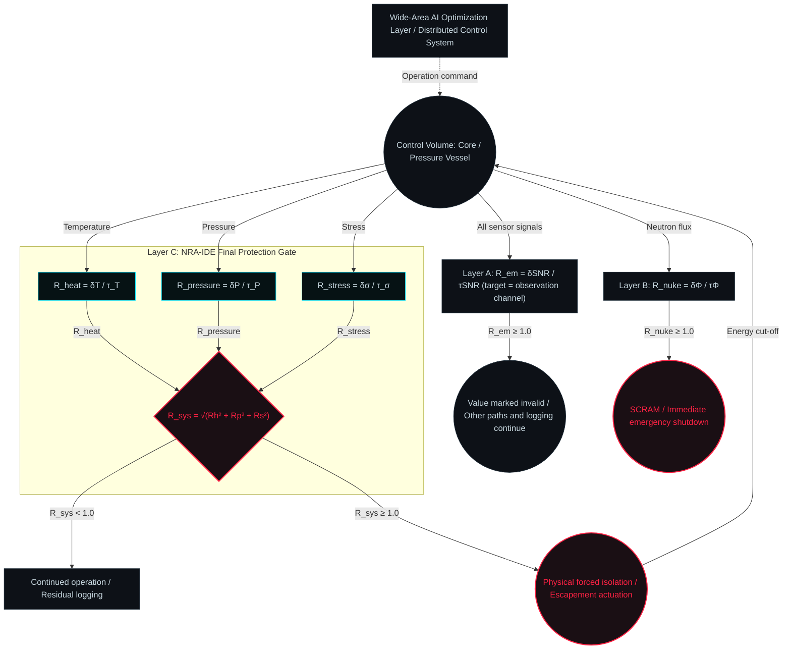

# NRA-IDE Multi-Physics Safety Gate Architecture

<!-- FILE: Multi-Physics_Safety_Gate_Architecture_EN.md / 2026-03-06 21:44 -->

**Version:** 2.0.0

**Target Domain:** Nuclear power plants and similar / Multi-Physics Systems

**Positioning:** This file is the **Source of Truth** for the base equations, sensor definitions, and system topology.

For the design philosophy and the rationale of the layer structure, refer to `NRA-IDE_IPL_3Layer_Monitor_EN.md`.

---

## 0. How to Read This Document

The equations in this document are structural formulas. They are neither mathematical proofs nor predictors of the time of rupture.

Which quantities instantiate $\delta$ and $\tau$ in $R = \delta / \tau$ varies greatly with the site and the governing factors. This document does not prescribe that instantiation.

The position of each limit is declared per domain. $R = 1.0$ denotes the declared limit of the declared target; it is not a physical constant.

The point of the limit does not need to be determined uniquely. Operation involves situational judgment.

After the boundary is reached, the priority is to sever output and execution authority and to preserve the record. It is not to refine the estimate of the approach ratio.

Reading this document as a specification and demanding exact numerical agreement is a misreading. The requirement is not to depart from the underlying way of thinking.

---

## 1. Fundamental Architecture Concept (Connection vs Mixing)

This architecture completely separates the following three layers.

| Layer | Name | Role |
|---|---|---|
| Layer A | Electromagnetic Data Integrity Assurance | Verification of sensor measurement reliability (precondition) |
| Layer B | Nuclear Reaction Dynamics Gate | Monitoring of upstream causality and SCRAM judgment (pre-stage gate) |
| Layer C | NRA-IDE Final Protection Gate | Structural limit judgment by orthogonal synthesis of heat, pressure, and stress |

No layer references the judgment result of another layer. The moment any one of them detects $R \geq 1.0$ , it independently issues Fail-Closed.

The multiple physical dimensions (heat, pressure, stress) are not mixed at intermediate stages; each is computed as an independent dimensionless tension vector, and only at the final gate of Layer C are they orthogonally synthesized (Connection).

---

## 2. Layer A: Electromagnetic Data Integrity Assurance

### Definition

The target declared by Layer A is the observation channel itself, not the target structure. Because the declared target differs from that of $R_{sys}$ in Layer C, the two must not be compared or combined.

$$R_{em} = \frac{\delta_{SNR}}{\tau_{SNR}}$$

| Variable | Definition |
|---|---|
| $\delta_{SNR}$ | Degradation from the reference SNR (accumulated deviation) |
| $\tau_{SNR}$ | Absorption thickness from that same reference to the trust floor |

> **Note:** $\delta_{SNR}$ and $\tau_{SNR}$ apply $R = \delta/\tau$ to SNR degradation as the monitored parameter. $R_{em} \neq \text{SNR}$ . R is a structural ratio (deviation relative to absorption thickness), and is a separate concept from SNR (signal-to-noise ratio).

### Boundary Condition

$$R_{em} \geq 1.0 \implies \text{The measured value is treated as invalid}$$

An invalid value is not filled in with 0, safe, stable, recovered, or ruptured.

Other observation channels, logging, and communication are not stopped. The judgment of Layer A does not remove the alarm authority of Layer B or Layer C.

If a required input is invalid, $R_{sys}$ in Layer C cannot be computed. The inability to compute is recorded neither as safe nor as ruptured.

The fact of the loss, its time, and the last valid value are recorded. Survival of each path is recorded separately from this formula, as stated in `FORMULA.md` § 0.

---

## 3. Layer B: Nuclear Reaction Dynamics Gate

### Definition

$$R_{nuke} = \frac{\delta\Phi}{\tau_{\Phi}}$$

| Variable | Definition |
|---|---|
| $\delta\Phi$ | Transient increment of neutron flux (deviation from the design steady-state value) |
| $\tau_{\Phi}$ | Structural margin up to prompt criticality (design value) |

### Boundary Condition

$$R_{nuke} \geq 1.0 \implies \text{SCRAM (emergency shutdown) issued immediately}$$

It is issued independently of the computation result of Layer C.

---

## 4. Layer C: Independent Fundamental Mechanics Modules (Orthogonal Dimensions)

Each sensor value is stripped of its physical unit and converted into three independent boundary-approach ratios ( $R$ ).

### Definition

**Common Precondition (Shared Reference Point):**

For all three components, $\delta$ is the accumulated deviation from the reference operating state declared before computation begins, and $\tau$ is the absorption thickness from that same reference to each limit.

The limit value itself (an absolute level) must not be substituted for $\tau$ .

This agreement makes $M_{\tau} = \tau - \delta$ in `FORMULA.md` § 2 hold as the remaining absorption margin for each component.

The orthogonal synthesis in § 5 is meaningful only on this shared reference.

**$R_{heat}$ (Thermodynamic Tension)**

$$R_{heat} = \frac{\delta T}{\tau_T}$$

| Variable | Definition |
|---|---|
| $\delta T$ | Temperature rise from the reference operating temperature (accumulated deviation) |
| $\tau_T$ | Absorption thickness from that same reference to the thermal-degradation limit of the structural material (effective value with the time lag statically deducted) |

**$R_{pressure}$ (Fluid Dynamic Tension)**

$$R_{pressure} = \frac{\delta P}{\tau_P}$$

| Variable | Definition |
|---|---|
| $\delta P$ | Transient pressure spike from the reference operating pressure (accumulated deviation) |
| $\tau_P$ | Absorption thickness from that same reference to the design pressure limit of the vessel |

**$R_{stress}$ (Structural Mechanics Tension)**

$$R_{stress} = \frac{\delta\sigma}{\tau_{\sigma}}$$

| Variable | Definition |
|---|---|
| $\delta\sigma$ | Stress increment from the reference stress state due to structural vibration and thermal expansion (accumulated deviation) |
| $\tau_{\sigma}$ | Absorption thickness from that same reference to the yield point of the material (dynamically scaled downward by residual integration of cumulative fatigue) |

---

## 5. Layer C: Orthogonal Vector Synthesis and Final Gate (Vector Synthesis)

The three-dimensional tensions are geometrically synthesized as the "degree of approach to the limit sphere" in a multidimensional phase space.

**Unified Base Equation:**

$$R_{sys} = \sqrt{R_{heat}^2 + R_{pressure}^2 + R_{stress}^2}$$

**Boundary Condition (Fail-Closed Rule):**

$$R_{sys} \geq 1.0 \implies \text{Physical forced isolation (escapement actuation)}$$

This judgment is not aimed at optimization; it functions purely as an evaluation of the structural limit.

---

## 6. System Topology

---

## 7. Design Principles

| Principle | Content |
|---|---|
| Independence of preconditions | Layers A and B are logically separate from Layer C. Common cause failure (CCF) is structurally eliminated |
| Strict causal order | The cause side (nuclear reaction, measurement) is not placed on the same level as the effect side (heat, pressure, stress) |
| Fail-Closed asymmetry | Fail-Closed can be triggered independently in each layer. An anomaly in one layer does not remove the alarm authority of another layer |
| Purity of orthogonal synthesis | Only truly independent physical dimensions are placed in the base equation |
| Separation of observation and logging | Rupture of the target does not mean that observation, logging, or communication stops. Surviving paths are not stopped |

---

*This file is the Source of Truth for the base equations and sensor definitions.*

*For the explanation of the design philosophy and rationale, refer to `NRA-IDE_IPL_3Layer_Monitor_EN.md`.*

*When another AI re-verifies this material, both files must be referenced together.*
