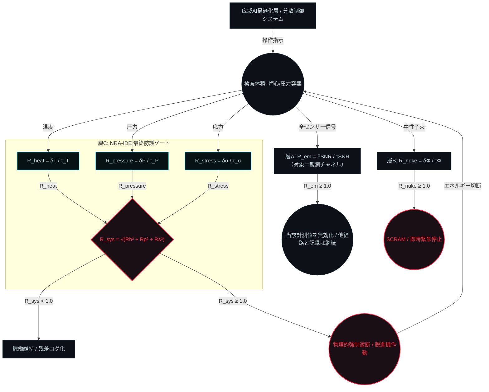

# NRA-IDE Multi-Physics Safety Gate Architecture

<!-- FILE: Multi-Physics_Safety_Gate_Architecture_JP.md / 2026-03-06 21:44 -->

**バージョン:** 2.0.0  

**対象領域:** 原子力プラントなど / 多重物理連成系（Multi-Physics System）  

**位置づけ:** 本ファイルは基礎式・センサー定義・システムトポロジーの **Source of Truth** である。  

設計思想・層構造の根拠については `NRA-IDE_IPL_3Layer_Monitor_JP.md` を参照すること。

---

## 0. 本書の読み方

本書の式は構造式である。数学的証明でも、破断時刻の予測式でもない。

$R = \delta / \tau$ の $\delta$ と $\tau$ をどの量で実体化するかは、現場と要因によって大きく変わる。本書はその実体化を規定しない。

限界の位置は領域ごとに宣言する。 $R = 1.0$ は宣言した対象の宣言した限界を指し、物理定数ではない。

限界の地点を一意に定めきる必要はない。運用には状況判断が伴う。

境界に達した後の優先順位は、出力と実行権限を切ることと、記録を残すことである。接近度の推定を精緻化することではない。

本書を仕様書として読み、数値の厳密一致を求めることは誤読である。根本の考え方を外さないことが要件である。

---

## 1. アーキテクチャ基本思想 (Connection vs Mixing)

本アーキテクチャは以下の3層を完全に分離する。

| 層 | 名称 | 役割 |
|---|---|---|
| 層A | 電磁気的データ完全性保証 | センサー計測値の信頼性確認（前提条件） |
| 層B | 核反応動特性ゲート | 上流因果の監視・SCRAM判定（前段ゲート） |
| 層C | NRA-IDE 最終防護ゲート | 熱・圧力・応力の直交合成による構造限界判定 |

各層は他層の判定結果を参照しない。いずれかが $R \geq 1.0$ を検出した瞬間、独立してFail-Closedを発令する。

複数の物理次元（熱・圧力・応力）は途中で混同（Mixing）されず、それぞれ独立した無次元テンションベクトルとして計算された後、層Cの最終ゲートにおいてのみ直交合成（Connection）される。

---

## 2. 層A：電磁気的データ完全性保証

### 定義

層Aが宣言する対象は観測チャネルそのものであり、対象構造ではない。層Cの $R_{sys}$ とは宣言対象が異なるため、両者を比較または合成してはならない。

$$R_{em} = \frac{\delta_{SNR}}{\tau_{SNR}}$$

| 変数 | 定義 |
|---|---|
| $\delta_{SNR}$ | 基準SNRからの劣化量（蓄積ズレ） |
| $\tau_{SNR}$ | 同一基準から信頼下限までの吸収厚み |

> **注記：** $\delta_{SNR}$ ・ $\tau_{SNR}$ は SNR 劣化量を監視対象パラメータとして $R = \delta/\tau$ に適用したものである。 $R_{em} \neq \text{SNR}$ 。R は構造比率（偏差対吸収厚み）であり、SNR（信号対雑音比）とは別概念である。

### 境界条件

$$R_{em} \geq 1.0 \implies \text{当該計測値を無効として扱う}$$

無効値を 0、安全、安定、回復または破断で補完しない。

他の観測チャネル、記録および通信は停止しない。層Aの判定は層B・層Cの発報権限を奪わない。

必要な入力が無効な場合、層Cの $R_{sys}$ は算出できない。算出できないことを安全とも破断とも記録しない。

観測が失われた事実、時刻および最後の有効値を記録する。経路ごとの生存状態は `FORMULA.md` § 0 のとおり本式とは別に記録する。

---

## 3. 層B：核反応動特性ゲート

### 定義

$$R_{nuke} = \frac{\delta\Phi}{\tau_{\Phi}}$$

| 変数 | 定義 |
|---|---|
| $\delta\Phi$ | 中性子束の過渡増分（設計定常値からの偏差） |
| $\tau_{\Phi}$ | 即発臨界に至るまでの構造的余裕（設計値） |

### 境界条件

$$R_{nuke} \geq 1.0 \implies \text{SCRAM（緊急停止）即時発令}$$

層Cの演算結果とは無関係に発令される。

---

## 4. 層C：独立基礎力学モジュール (Orthogonal Dimensions)

各センサーデータは物理単位を剥ぎ取られ、3つの独立した接近比（ $R$ ）へ変換される。

### 定義

**共通前提（基準点の一致）:**

3成分すべてについて、 $\delta$ は計算開始前に宣言した基準運転状態からの蓄積ズレ、 $\tau$ は同一基準から各限界までの吸収厚みとする。

$\tau$ に限界値そのもの（絶対水準）を代入してはならない。

この一致により、`FORMULA.md` § 2 の $M_{\tau} = \tau - \delta$ が各成分で残存吸収余白として成立する。

また、§ 5 の直交合成は共通基準上でのみ意味を持つ。

**$R_{heat}$ （熱力学テンション）**

$$R_{heat} = \frac{\delta T}{\tau_T}$$

| 変数 | 定義 |
|---|---|
| $\delta T$ | 基準運転温度からの温度上昇幅（蓄積ズレ） |
| $\tau_T$ | 同一基準から構造材の熱変性限界までの吸収厚み（時間ラグを静的に控除した実効値） |

**$R_{pressure}$ （流体力学テンション）**

$$R_{pressure} = \frac{\delta P}{\tau_P}$$

| 変数 | 定義 |
|---|---|
| $\delta P$ | 基準運転圧力からの過渡的な圧力スパイク（蓄積ズレ） |
| $\tau_P$ | 同一基準から容器の設計耐圧限界までの吸収厚み |

**$R_{stress}$ （構造力学テンション）**

$$R_{stress} = \frac{\delta\sigma}{\tau_{\sigma}}$$

| 変数 | 定義 |
|---|---|
| $\delta\sigma$ | 構造振動・熱膨張による、基準応力状態からの応力増分（蓄積ズレ） |
| $\tau_{\sigma}$ | 同一基準から材料の降伏点までの吸収厚み（累積疲労を残差積分で動的に下方スケーリング） |

---

## 5. 層C：直交ベクトル合成と最終ゲート (Vector Synthesis)

3次元のテンションは多次元位相空間における「限界球面への接近度」として幾何学的に合成される。

**統合基礎式:**

$$R_{sys} = \sqrt{R_{heat}^2 + R_{pressure}^2 + R_{stress}^2}$$

**境界条件（Fail-Closed Rule）:**

$$R_{sys} \geq 1.0 \implies \text{物理的強制遮断（脱進機作動）}$$

この判定は最適化を目的とせず、純粋な構造限界の評価として機能する。

---

## 6. システムトポロジー (System Topology)

---

## 7. 設計原則

| 原則 | 内容 |
|---|---|
| 前提条件の独立性 | 層A・Bは層Cとは論理的に別層。共通原因故障（CCF）を構造的に排除する |
| 因果順序の厳守 | 原因側（核反応・計測）を結果側（熱・圧力・応力）と同列に置かない |
| Fail-Closed非対称性 | 各層で独立してFail-Closedが発動可能。ある層の異常は他層の発報権限を奪わない |
| 直交合成の純粋性 | 基礎式には真に独立した物理次元のみを配置する |
| 観測と記録の分離 | 対象の破断は観測・記録・通信の停止を意味しない。生存する経路は止めない |

---

*本ファイルは基礎式・センサー定義の Source of Truth である。*  

*設計思想・根拠の解説は `NRA-IDE_IPL_3Layer_Monitor_JP.md` を参照すること。*  

*他AIによる再検証時は両ファイルを合わせて参照すること。*
