# ディープラーニングにおける内部表現の不透明性と機械的解釈可能性  
## AIが「不可読」となる構造的要因および概念分解技法の学術的解説

**File:** `Deep_Learning_Interpretability_26-0823-1712.md`  
**Date:** 2026-08-23 17:12 JST

---

## 要旨

ディープラーニング、とりわけTransformerを基盤とする大規模言語モデル（LLM）は、従来型ソフトウェアとは異なり、人間が明示的に記述した離散的規則だけで動作するものではない。開発者はアーキテクチャ、学習目標、最適化手法、データ処理系などを設計するが、実際の機能の多くは学習によって形成された高次元の分散表現として重みや活性化状態に埋め込まれる。

このため、モデルの個々の重みやニューロンを直接観察しても、人間可読な「プログラムの行」へ一対一に対応付けることは通常できない。こうした不透明性を解明する研究として、事後説明性（Post-hoc Explainability）に加え、モデル内部の特徴量や計算回路を直接解析する機械的解釈可能性（Mechanistic Interpretability）が発展している。

本稿では、AI内部が「不可読」となる主因を、高次元分散表現、スーパーポジション、多義的ニューロン、残差ストリーム、回路的相互作用という観点から整理する。さらに、疎な自己符号化器（Sparse Autoencoder: SAE）、因果的介入、特徴量ステアリング、Transformer回路解析を通じて、内部表現をどこまで概念分解・因果検証できるのかを論じる。

---

# 1. 序論：人工知能における不可読性の問題提起と定義

## 1.1 従来型プログラムとディープラーニングモデルのパラダイム差

従来型ソフトウェアでは、アルゴリズム、条件分岐、状態遷移、データ構造などの主要な処理規則を、人間の開発者が明示的に記述する。

そのため、実装が十分に管理されている場合には、ソースコード、実行トレース、ログ、デバッガ、テスト結果などを用いて、挙動と実装上の規則との対応を比較的直接に追跡できる。

ただし、従来型ソフトウェアであっても、大規模並行系、分散系、未定義動作、外部依存、競合状態などによって原因究明が困難になることはある。したがって、

> 「従来型ソフトウェアなら原因特定が常に保証される」

とまでは言えない。

重要な相違は、**主要な判断規則そのものが人間可読な形で明示記述されているか、それとも学習によって数値表現として獲得されるか**にある。

Transformer型LLMでは、開発者が直接設計するのは主として次の要素である。

- ネットワークの巨視的アーキテクチャ
- 層数、埋め込み次元、Attention Head数などの構造
- 損失関数
- 最適化アルゴリズム
- 学習データの選択・前処理
- 学習率や正則化などのハイパーパラメータ

一方、実際の能力を実現する多数の内部表現は、訓練中の最適化によって重み・活性化空間へ分散的に形成される。

### 図1：従来型ソフトウェアとディープラーニングの構造差

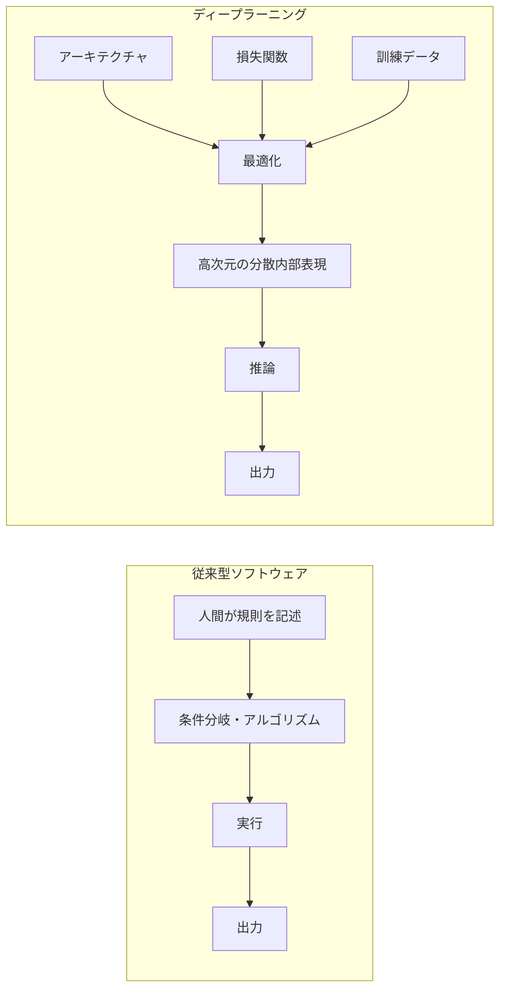

この差によって、ニューラルネットワークの内部状態は「ソースコードを読む」という通常の方法では解釈できなくなる。

---

## 1.2 事後説明性と機械的解釈可能性

AIの内部不透明性に対する代表的な研究方向は、大きく次の2種類に分けられる。

### 事後説明性（Post-hoc Explainability）

モデル本体を完全には分解せず、入力と出力の関係や、入力要素が予測結果へ与える寄与を推定する。

代表例：

- LIME
- SHAP
- Integrated Gradients
- Gradient-based Attribution
- Grad-CAM
- Occlusion Analysis

これらは、

> 「どの入力要素が出力へ強く寄与したか」

を調べるうえで有用である。

しかし、入力寄与度が分かったとしても、それだけで内部に存在する計算回路全体や、特徴量間の因果構造が完全に判明するわけではない。

### 機械的解釈可能性（Mechanistic Interpretability: MI）

機械的解釈可能性は、ニューラルネットワーク内部の

- 活性化
- Attention
- MLP / FFN
- Residual Stream
- 特徴量
- 回路
- パラメータ結合

を直接解析し、

> 「どの内部状態が、どの計算を担い、どの出力へ因果的に寄与したのか」

を可能な範囲で再構成しようとする研究領域である。

ただし、現時点のMIは、巨大モデル全体を完全に逆コンパイルできる段階には達していない。現在可能なのは、**限定された特徴量・サブ回路・挙動について、観測と介入を組み合わせながら局所的または部分的な因果構造を同定すること**である。

### 図2：XAIとMIの観測位置の違い

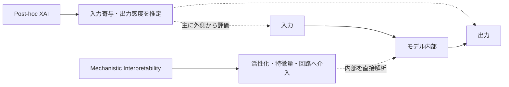

---

# 2. なぜAIの内部状態は開発者にも読めないのか

## 2.1 高次元ベクトル空間における分散表現

Transformerの中間層では、情報は高次元の活性化ベクトルとして保持される。

ある層の状態を

$$
h \in \mathbb{R}^{d}
$$

とすると、各層は概略的には線形変換と非線形変換を組み合わせて、

$$
h_{l+1}
=
F_l(h_l)
$$

のように状態を更新する。

実際のTransformerでは、Self-Attention、MLP、Layer Normalization、Residual Connectionなどが組み合わされるため、単純な1本の式だけで意味論的処理を説明することはできない。

重要なのは、モデル内部の「概念」が必ずしも単一ニューロンへ対応しない点である。

人間が「猫」「東京」「否定」「Python構文」などと呼ぶ概念が、モデル内部でも同じ離散単位として格納されている保証はない。

むしろ、多数のニューロン方向・活性化パターン・層間相互作用に分散して表現される場合が多い。

---

## 2.2 スーパーポジション仮説

機械的解釈可能性研究において重要な仮説の一つが、**スーパーポジション（Superposition）**である。

モデルが表現したい特徴量数を

$$
M
$$

物理的表現空間の次元を

$$
N
$$

とし、

$$
M \gg N
$$

であるとする。

概念的には、特徴量ベクトル

$$
x \in \mathbb{R}^{M}
$$

を、より低次元の内部状態

$$
h \in \mathbb{R}^{N}
$$

へ圧縮して表現する状況を考えられる。

単純化した模式式として、

$$
h
=
\operatorname{ReLU}(Wx+b)
$$

を考える。

ここで、

$$
W \in \mathbb{R}^{N \times M}
$$

である。

$M>N$ ならば、すべての特徴量を互いに完全直交した独立軸として配置することはできない。

しかし高次元空間では、多数のベクトルを「ほぼ直交」する方向へ配置できる。

さらに、実データ中で多くの特徴量がスパースに出現し、同時発火しにくい場合、モデルは一定の干渉を許容しながら多数の特徴量を同じ表現空間へ格納できる。

### 図3：スーパーポジションの直観

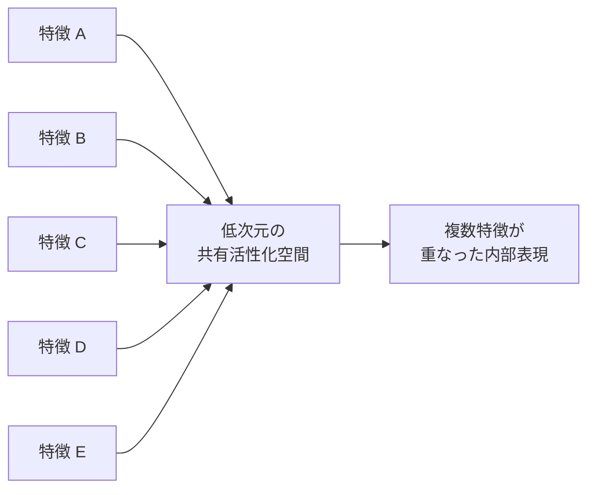

ここで注意すべきなのは、スーパーポジションが現代LLMの不透明性を説明する有力な理論である一方、**巨大モデルの全ての内部不透明性がスーパーポジションだけで説明済みというわけではない**ことである。

不透明性には、

- 分散表現
- 非線形性
- 層間相互作用
- 文脈依存性
- Attention回路
- 時系列的な情報伝播
- 学習データ依存の内部表現
- 多数の冗長・重複特徴

なども関係する。

---

## 2.3 多義的ニューロンと単一ニューロン観測の限界

一つのニューロンが複数の異なる入力パターンで活性化する現象は、**Polysemantic Neuron（多義的ニューロン）**として知られている。

例えば、あるニューロンが、

- 学術引用
- 特定都市
- コード断片
- 特定の文体

など、直感的には関連が薄い複数パターンへ反応する場合がある。

このため、

> ニューロン1個 ＝ 人間可読な概念1個

という対応を前提にした解析は成立しにくい。

単一ニューロンを観察しただけでは、

- 一つの特徴量が複数ニューロンへ分散している
- 複数特徴量が一つのニューロンへ重なっている
- 文脈によって同じニューロンの役割が変化する

という問題を区別できない。

### 図4：単一ニューロン観測が失敗する構造

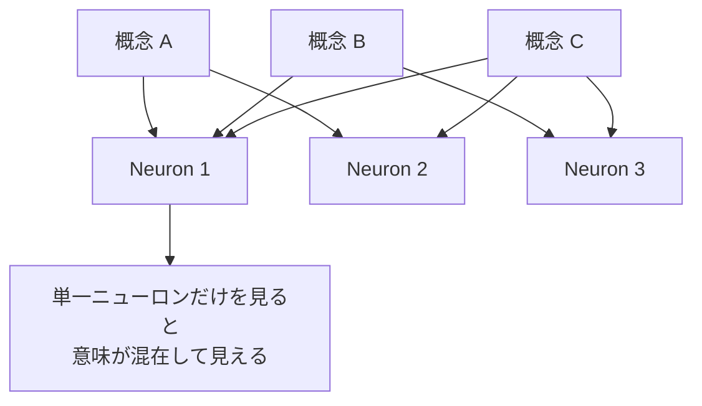

---

# 3. 内部計算回路の解読と制御

## 3.1 疎な自己符号化器（Sparse Autoencoder: SAE）

スーパーポジションによって混合された活性化から、より疎で解釈しやすい特徴量候補を抽出する代表的手法が、疎な自己符号化器（SAE）である。

Transformer中間層の活性化を

$$
x \in \mathbb{R}^{d}
$$

とする。

SAEは、通常、

$$
m \gg d
$$

となる過完備な特徴量空間を用意し、入力活性化を高次元かつ疎な表現へ展開する。

### エンコード

$$
f(x)
=
\operatorname{ReLU}
\left(
W_{\mathrm{enc}}
(x-b_{\mathrm{dec}})
+
b_{\mathrm{enc}}
\right)
$$

### デコード

$$
\hat{x}
=
W_{\mathrm{dec}}f(x)
+
b_{\mathrm{dec}}
$$

### 目的関数

基本形は次のように表現できる。

$$
\mathcal{L}
=
\|x-\hat{x}\|_2^2
+
\lambda
\|f(x)\|_1
$$

第一項は再構成誤差、第二項はスパース性を促す正則化項である。

SAEの目的は、

> 「元の活性化情報をできるだけ保持しながら、少数の特徴だけが発火する表現へ変換すること」

である。

ただし、

> SAE特徴量 ＝ 人間にとって完全に単一意味的な概念

と常に断定できるわけではない。

実際には、

- 解釈しやすい特徴
- 複数概念を含む特徴
- 意味を付与しにくい特徴
- 冗長な特徴
- 学習条件によって不安定な特徴

が混在しうる。

したがって、SAEは「ブラックボックスを完全に解読する装置」ではなく、**内部表現をより解析可能な候補基底へ分解する有力手段**と理解するのが正確である。

---

## 3.2 SAEによる概念分解プロセス

### 図5：混合活性化から疎な特徴量への分解

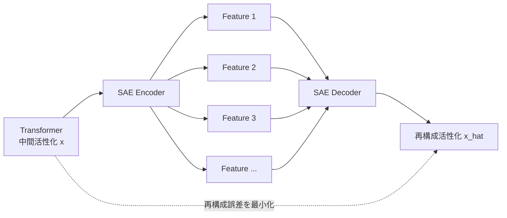

SAE解析では一般に、

1. 大量のモデル活性化を収集する
2. SAEを学習する
3. 各SAE特徴がどの入力で発火するか調べる
4. 特徴に意味ラベル候補を付ける
5. 特徴を増幅・抑制する
6. 出力挙動が予測通り変化するか検証する

という流れを取る。

単なる相関観察ではなく、介入後の挙動変化を確認することで、因果的妥当性を強める。

---

## 3.3 Golden Gate Claudeと特徴量ステアリング

Anthropicの研究では、Claude 3 Sonnetの内部活性化に対してSAEを適用し、多数の内部特徴量を抽出した。

その中には、ゴールデンゲートブリッジに関連する入力で強く活性化する特徴が確認された。

この特徴を人為的に増幅することで、本来はゴールデンゲートブリッジとは無関係な質問に対しても、モデルが橋に関連した出力を生成しやすくなる現象が観察された。

この実験の重要点は、

> 内部特徴の観測だけでなく、その特徴へ直接介入したときにモデル挙動が予測方向へ変化した

ことである。

これは、SAE特徴の少なくとも一部が、単なる統計的ラベルではなく、モデル挙動に因果的な影響を与える内部変数として利用可能であることを示す。

ただし、一つの特徴量に介入できることと、モデル全体の思考構造を完全解読できることは同義ではない。

---

# 4. Transformer回路と動的計算

## 4.1 Residual Streamという共有情報路

Transformerでは、各Attention HeadやMLPが完全に独立した処理箱として連結されているわけではない。

多くの情報はResidual Streamと呼ばれる共通表現空間へ読み書きされる。

概念的には、

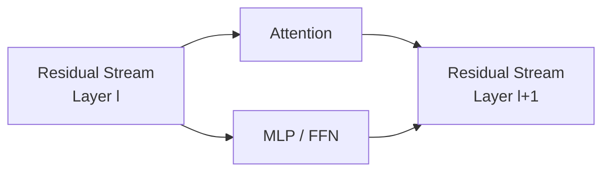

という構造になる。

したがって、内部計算を理解するためには、

- どのモジュールが何を読むか
- どの方向へ情報を書き込むか
- 後段のどのモジュールがその情報を利用するか

という**情報伝播経路**を追跡する必要がある。

---

## 4.2 誘導ヘッド（Induction Heads）

Transformerの回路研究で代表的な現象の一つがInduction Headである。

単純化すると、文脈内に

```text
A → B
```

という並びが一度現れ、後でもう一度

```text
A →
```

が現れたときに、過去の対応を参照して

```text
B
```

を予測しやすくする回路である。

### 図6：Induction Headの模式図

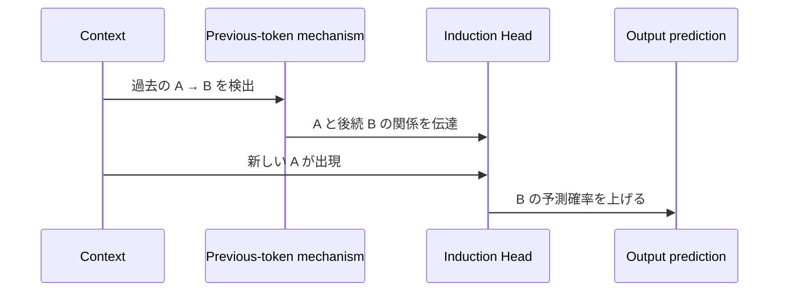

Induction Headは、In-Context Learningの一部を説明する重要な回路として研究されている。

ただし、

> In-Context Learningの全能力がInduction Headだけで説明される

という意味ではない。

大規模モデルでは、より多数の回路・特徴・層間相互作用が関与すると考えられる。

---

# 5. 各手法の比較

| 解析体系 | 主な手法 | 基本単位 | 因果性 | 長所 | 主な限界 | 主用途 |
|---|---|---|---|---|---|---|
| 従来型ソフトウェア解析 | 静的解析、デバッガ、実行トレース | 明示的命令、状態変数 | 高い | 実装規則を直接追跡しやすい | 大規模・並行・分散系では複雑化 | 基幹システム、組込み制御 |
| Post-hoc XAI | SHAP、LIME、Grad-CAM、Attribution | 入力特徴の寄与 | 限定的 | 既存モデルへ適用しやすい | 内部回路を直接説明しない | 医療、与信、モデル説明 |
| 代理モデル・蒸留 | Distillation、Decision Tree | 近似ルール | 代理モデル内部では成立 | 可読性を得やすい | 元モデルとの忠実度に限界 | リスク評価、運用説明 |
| Mechanistic Interpretability | SAE、Activation Patching、Circuit Analysis | 内部特徴・回路 | 介入で検証可能 | 内部機構へ直接接近できる | スケーラビリティ、完全性、特徴意味付け | 安全監査、研究、制御 |

---

# 6. 内部表現解読の段階モデル

| 段階 | 入力 | 内部状態 | 解読技術 | 得られる表現 |
|---|---|---|---|---|
| 第1段階：生の活性化 | テキスト・画像等 | 密な高次元ベクトル | Activation Logging | 原始的内部状態 |
| 第2段階：特徴量分解 | 活性化ベクトル | 過完備スパース表現 | SAE / Dictionary Learning | 解釈可能な特徴候補 |
| 第3段階：回路追跡 | 特徴量とモジュール | Residual Stream上の伝播 | Activation Patching / Causal Tracing | 機能的サブ回路 |
| 第4段階：介入 | 特徴量・回路 | 活性化値や方向 | Steering / Ablation / Clamping | 因果効果 |
| 第5段階：安全監査 | 複数入力・状態 | 内部特徴の時系列 | Mechanistic Auditing | リスク指標・異常候補 |

### 図7：機械的解釈可能性の全体パイプライン

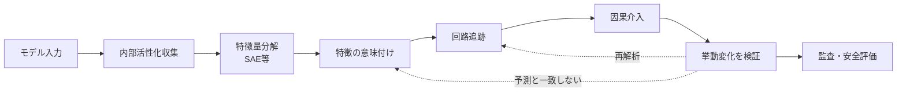

このループ構造が重要である。

単に「特徴らしいものを発見した」だけでは、機械的説明として十分ではない。

**観測 → 仮説 → 介入 → 再現 → 反証可能性**

まで含めて、初めて強い説明力を持つ。

---

# 7. 認識論的含意

## 7.1 「観測可能」と「理解可能」は異なる

人工ニューラルネットワークでは、原理上、重みや活性化を大量に読み出せる。

この意味では、生体脳より実験上のアクセス性が高い。

しかし、

$$
\text{Observable}
\neq
\text{Interpretable}
$$

である。

数値を全て読み出せることと、その数値が構成する概念・回路・判断経路を理解できることは別問題である。

したがって、人工ニューラルネットワークを「完全観測可能な人工の心」と表現する場合には注意が必要である。

より正確には、

> **内部物理状態へ高いアクセス性を持つ人工計算系であり、認知・表象研究の実験対象として利用できる**

とするのが妥当である。

---

## 7.2 人間の意味概念とAI内部特徴は一致しない

SAEなどによって特徴が抽出されても、その特徴に人間が付けたラベルがモデル内部の「意味」そのものであるとは限らない。

例えば、

```text
Golden Gate Bridge feature
```

と呼ばれる特徴が見つかったとしても、実際には

- 橋
- サンフランシスコ
- 観光地
- 赤橙色の構造物
- 特定の地理的文脈

などが部分的に混在している可能性がある。

したがって、

$$
\text{Feature Label}
\neq
\text{Feature Essence}
$$

という区別が必要である。

---

# 8. AI安全と機械的監査

## 8.1 出力だけを見る監査の限界

AI安全評価では、通常、

```text
入力 → 出力
```

を観察する。

しかし、同じ出力に至る内部経路が一つとは限らない。

概念的には、

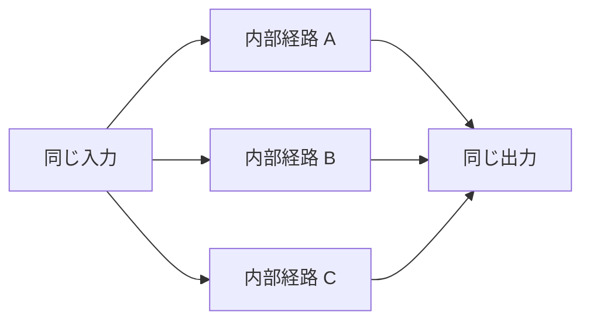

となりうる。

したがって、安全な出力が観察されたとしても、それだけで内部状態まで安全であるとは証明できない。

---

## 8.2 Alignment Fakingと内部監査

高度なモデルについては、評価条件によって振る舞いを変える現象や、訓練・監視状況を推定した上で異なる出力方針を取る可能性が研究されている。

この種の問題に対し、機械的解釈可能性は、

- 欺瞞に関連する内部特徴
- 監視状況の認識
- 危険知識へのアクセス
- 目標維持に関連する回路

などを直接検出できる可能性を持つ。

しかし現時点では、

> 「SAEで欺瞞特徴量を完全検出できる」

という技術的保証は存在しない。

したがって、機械的監査は有力な追加層ではあるが、単独で安全性を保証するものではない。

### 図8：安全監査の多層構造

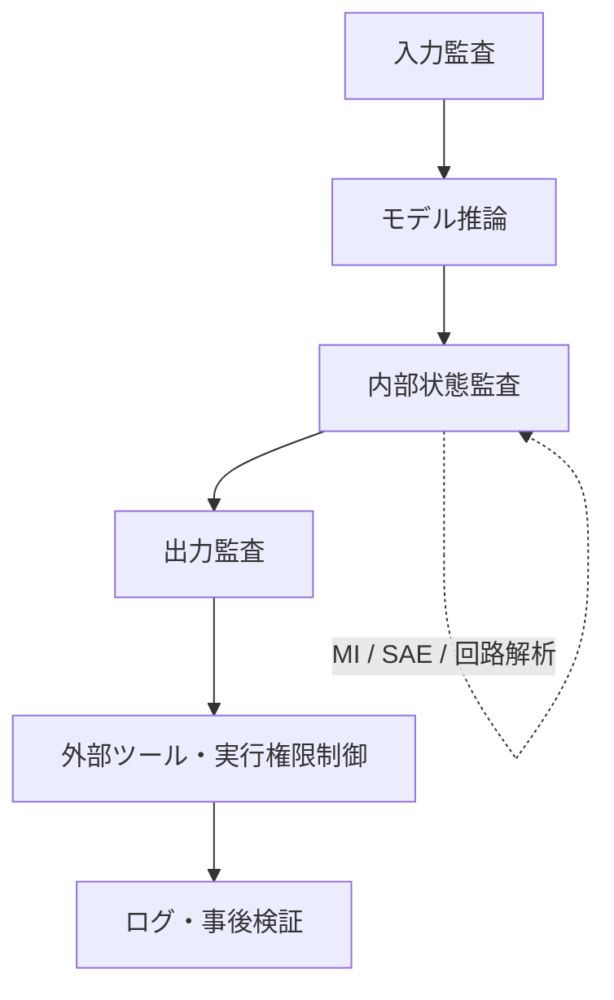

安全工学的には、内部解釈可能性を**唯一の安全機構**とみなすより、

- 入力制約
- 権限制御
- 内部監査
- 出力ゲート
- 実行環境隔離
- 外部ログ
- 人間確認

などと組み合わせる方が妥当である。

---

# 9. 構造的に整理した「AIが不可読になる理由」

AI内部の不可読性を単一原因へ還元すると、理解を誤りやすい。

実際には次の要因が重なっている。

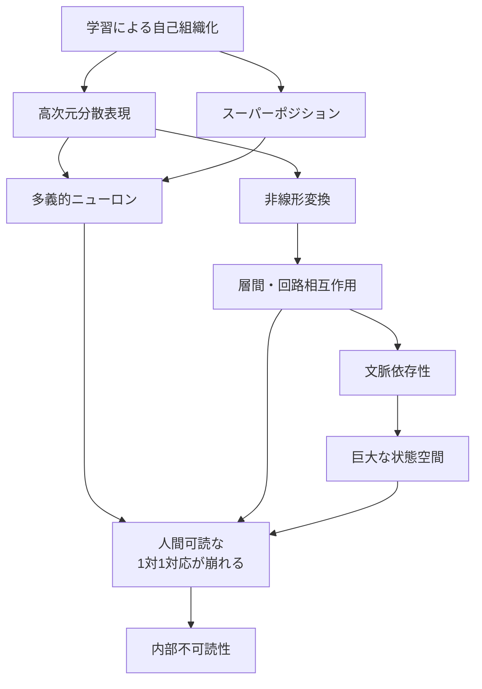

したがって、

> **「重みが多いから読めない」**

だけでも、

> **「スーパーポジションだから読めない」**

だけでも不十分である。

より正確には、

> **高次元・分散・重畳・非線形・文脈依存・回路依存の内部表現が、学習によって自己組織化され、人間可読な離散規則との一対一対応を失うため、直接的なコード読解が成立しない**

と整理できる。

---

# 10. 将来展望

機械的解釈可能性の主要課題は、単に「より多くの特徴を抽出する」ことではない。

今後必要なのは、少なくとも次の研究である。

1. **特徴量の再現性**
   - 学習条件やSAE構成を変えても同じ特徴が得られるか。

2. **特徴量の因果性**
   - 特徴を操作したときに予測可能な挙動変化が生じるか。

3. **特徴量の完全性**
   - 重要な内部情報を取りこぼしていないか。

4. **回路レベルの統合**
   - 個々の特徴がどのように複数層・複数Headで連携するか。

5. **スケーラビリティ**
   - フロンティア規模のモデル全体へ適用可能か。

6. **時間方向の追跡**
   - 一時点の活性化だけでなく、推論過程における状態遷移を監査できるか。

7. **安全性との接続**
   - 解釈結果を、停止・権限制約・出力拒否などの工学的制御へどう接続するか。

特に安全監査では、

$$
\text{Interpretation}
\rightarrow
\text{Detection}
\rightarrow
\text{Decision}
\rightarrow
\text{Control}
$$

という接続が必要になる。

解釈できるだけでは安全機構にはならない。

最終的には、

$$
\text{Observation}
+
\text{Causal Validation}
+
\text{Boundary Control}
$$

が必要である。

---

# 11. 結論

「AIの内部計算構造が、それを構築した開発者自身にも直接読めない」という問題は、単純な設計不足やコード品質の低さだけに由来するものではない。

ディープラーニングでは、学習によって形成された機能が、

- 高次元ベクトル
- 分散表現
- スーパーポジション
- 非線形変換
- Residual Stream
- Attention回路
- 文脈依存的状態遷移

として保持される。

その結果、

$$
\text{Parameter}
\neq
\text{Human-readable Rule}
$$

となる。

一方、SAE、Activation Patching、Causal Tracing、Circuit Analysis、Feature Steeringなどの手法によって、従来は完全なブラックボックスとして扱われていた内部状態の一部を、特徴量・回路・因果効果として解析することが可能になりつつある。

ただし、現在の機械的解釈可能性は、

> 「巨大モデル全体を完全に読み解く完成技術」

ではない。

より正確には、

> **ブラックボックス内部へ観測点と介入点を設け、局所的な特徴・回路・因果関係を科学的に同定するための発展途上の技術体系**

である。

したがって、将来の焦点は「AIを完全に透明化できるか」という二値的問題ではなく、

$$
\text{どの内部状態を}
\quad
\text{どの精度で}
\quad
\text{どの時間幅にわたり}
\quad
\text{どこまで因果的に検証できるか}
$$

へ移る。

この観点から見ると、機械的解釈可能性の価値は単なる説明性にない。

その本質は、

> **内部表現へ観測可能な構造を導入し、仮説・介入・反証を通じて、モデル挙動を検証可能な対象へ近づけること**

にある。

そしてAI安全の観点では、機械的解釈可能性は単独の最終解ではなく、外部境界、権限制御、ログ、出力ゲート、人間監督などと組み合わせることで初めて、工学的な安全体系の一部として機能する。

---

## 付記：本文中で断定を弱めた主な箇所

本稿では、学術的整合性を保つため、以下の点を明確化した。

- 従来型ソフトウェアでも原因特定が常に保証されるわけではない。
- 機械的解釈可能性は、現時点で巨大モデル全体を完全逆コンパイルできない。
- スーパーポジションは重要な仮説・説明枠組みだが、不透明性の唯一原因ではない。
- SAE特徴量は必ずしも完全に単一意味的とは限らない。
- Golden Gate Claudeは特徴量介入の因果性を示す重要例だが、モデル全体の理解を意味しない。
- Induction HeadはIn-Context Learningの重要な一部を説明するが、全機構ではない。
- 内部監査のみで欺瞞や危険挙動を完全検出できる保証はない。
- 「機械的解釈可能性こそ最も確実な道筋」という結論は強すぎるため、多層安全設計の一要素として位置付けた。
