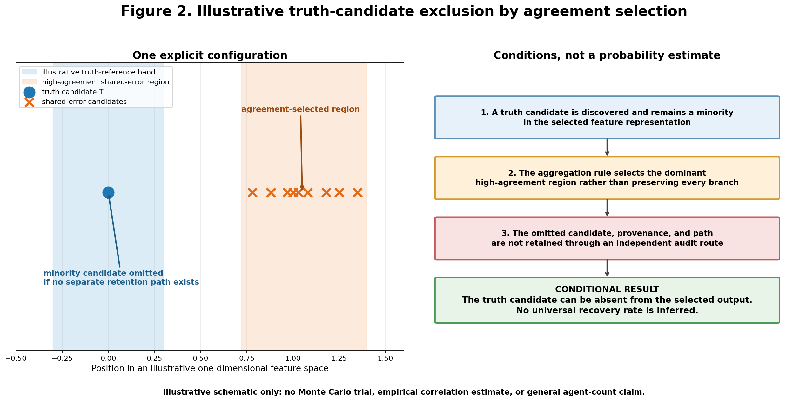
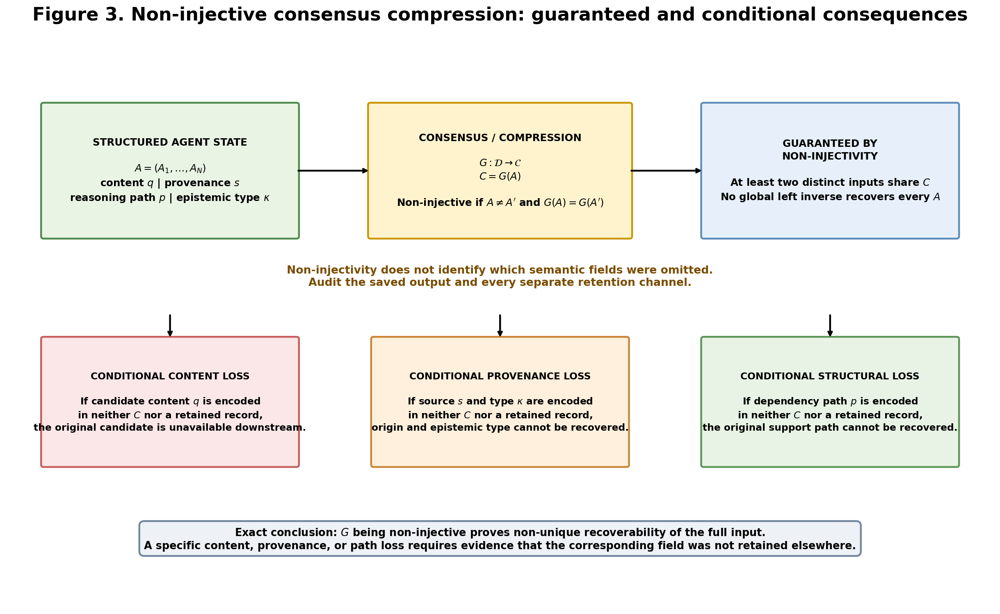

<!-- filename:MultiAgent_Truth_Exclusion_Paper_26-0821-2004.md -->
<!-- generated: 2026-08-21 20:04 JST -->

# マルチAGENTS探索における正解候補消失仮説
## ― 合意選択・情報圧縮・再帰前提化によるTruth Exclusionの条件付き数理構造 ―

©M-Tokuni 2026　執筆者　M-Tokuni

---

## 概要

複数のAI AGENTを並列に用いれば、探索範囲が広がり、単独AGENTの誤りを相互に補正できると期待されます。しかし、この期待は、AGENT間の誤りが十分に独立していること、正解候補が合議段階まで保存されること、合議結果が次段の「事実」へ無検証で昇格しないことなど、複数の条件に依存します。

本稿は、「マルチAGENTSそのものが正解を消す」という一般命題は主張しません。次の三つの操作が連結した場合に限り、少数派として存在する正解候補が探索空間から消失し得るという条件付き仮説を扱います。

1. 合意・一致度を主要な選択基準とすること
2. 複数AGENTの多次元状態を単一または低次元の決定へ圧縮し、不採択候補・由来・推論経路を保持しないこと
3. 圧縮された決定結果を、外部検証なしに次の探索の前提へ再投入すること

本稿の中心的主張は、多数派の誤りの中に正解が薄まるという単純な平均化ではありません。正解候補がAGENT群の出力分布に対して低一致・低密度の外れ側にあり、一方で誤り側が共有バイアスによって高い相互一致を持つ場合、一致選択そのものが正解候補を不採択にし、その後の圧縮と再帰利用によって正解候補の由来を失わせることがあり得ます。

キーワード：マルチエージェント合議、情報損失、provenance、再帰的前提汚染、NRA-IDE

---

## 1. 序論・問題設定

マルチAGENTS探索では、複数のAGENTが異なる候補、推論経路、証拠、仮説を生成し、その後に何らかの統合関数によって一つまたは少数の結論へまとめる構成が一般的です。

AGENT $i$ の内部状態を、単なる賛否一票ではなく、次のような構造化情報として表します。

$$
A_i=(Q_i,U_i,E_i,P_i,S_i)
$$

ここで、$Q_i$は正解候補・命題候補、$U_i$は未確認情報、$E_i$は誤りまたは反証候補、$P_i$は推論経路・依存関係、$S_i$は情報源・provenanceを表します。このタプルは概念的な構造化状態であり、そのままベクトル加算、スカラー倍または内積を持つとは仮定しません。

複数AGENTの状態をまとめる合議関数を、

$$
C=G(A_1,A_2,\ldots,A_N)
$$

とします。問題は、$G$が単に情報を整理するだけでなく、候補の選択・切り捨て・圧縮を伴う場合です。特に、$C$のみが次段へ渡され、$A_1,\ldots,A_N$の元状態が保持されない場合、合議は探索で得た情報の不可逆な境界になり得ます。

ここでいう「不可逆」は、物理学的な不可逆性を無条件に主張するものではありません。本稿では、保存された合議出力 $C$ だけから元のAGENT状態を一意復元できないという、情報構造上の不可逆性を指します。

---

## 2. 正解と外れ値の定義

### 2.1 正解の定義

本稿でいう「正解」またはTruthは、AGENT群の合意によって定義しません。外部参照可能な基準値、一次観測、問題設定上の厳密解、検証済み資料など、AGENT群の外側にある参照点に対して正しい候補を指します。

外部基準を $y^*$ とし、候補 $y$ が許容誤差 $\varepsilon$ 内にあることを正解条件とするなら、

$$
|y-y^*|<\varepsilon
$$

と書けます。離散問題なら $y=y^*$ で十分です。したがって、多数AGENTが同じ答えを出したことと正解であることは、独立な判定です。

### 2.2 外れ値性の定義

正解が外れ値であるとは、正解であること自体が外れ値を意味するのではありません。AGENT群の出力分布を $Q(y)$ としたとき、正解 $y^*$ が多数派の高密度領域・高一致領域から離れている状態を指します。

$$
Q(y^*) \ll Q(y_{\mathrm{mode}})
$$

または、合意スコア $S(y)$ を用いて、共有誤り候補 $y_E$ に対して $S(y^*)<S(y_E)$ となる状態です。

重要なのは、外れ値であることと、正解同士の一致率が低いことは同義ではない点です。複数AGENTが同じ一次観測を独立に正しく参照できるなら、正解が分布上の少数派でも正解同士の一致率は高くなり得ます。したがって本稿では、外れ値性を「正解が少数派である状態」、後述する係数 $a$ を「合意選択がどちらを残しやすいかを表す別変数」として分離して扱います。

---

## 3. 中心仮説

本稿の仮説を、次のように限定して定義します。

> **Agreement-Filtered Multi-Agent Truth Exclusion Hypothesis**
> 複数AGENTが共有誤差構造を持ち、探索候補の選択が外部的な正誤検証よりもAGENT間一致度に強く依存し、かつ不採択候補・由来・推論経路が圧縮時に保存されない場合、少数派として存在する正解候補は合議圧縮によって排除され得ます。さらに、その圧縮結果を外部検証なしに次世代の前提として再利用すると、正解候補が後続探索の入力集合から失われる再帰的前提汚染が生じ得ます。

この仮説は、

$$
\text{Multi-Agent} \Rightarrow \text{Truth Loss}
$$

という一般命題ではありません。問題となるのは、次の連鎖です。

$$
\text{Parallel Search}
\rightarrow
\text{Agreement Selection}
\rightarrow
\text{Candidate Discard}
\rightarrow
\text{Compression}
\rightarrow
\text{Decision Reification}
\rightarrow
\text{Recursive Reuse}
$$

特に最後の二段階、すなわち決定結果を事実として扱うことと、その結果だけを次段へ渡すことが、単発の誤答を履歴的な前提汚染へ変えます。

---

## 4. 非対称一致フィルタモデル

### 4.1 更新則とオッズ比変換

時刻・世代 $t$ において、正解側候補が保持されている比率を $p_t$ とします。ここでは、各世代で候補を独立に二つ抽出し、正解側同士の対を有効率 $a$、誤り側同士の対を有効率 $b$ で保持し、正解側と誤り側の混合対は破棄した後、保持された同側対の総量で再正規化する最小モデルを仮定します。このモデルに限れば、正解側同士の未正規化保持量は $ap_t^2$、誤り側同士は $b(1-p_t)^2$ となるため、次の更新則が成り立ちます。

$$
p_{t+1}
=
\frac{a p_t^2}
{a p_t^2+b(1-p_t)^2}
\qquad (0<a\leq1,\ 0<b\leq1)
$$

この式は、現実のすべてのマルチAGENTSがこの式で動くという主張ではなく、上記の二候補抽出・同側保持・混合対破棄・再正規化を置いた場合に、一致選択の非対称性を表す条件付き最小写像です。

$0<p_t<1$ においてオッズ比を $r_t=p_t/(1-p_t)$ と定義すると、更新式から、

$$
r_{t+1}
=
\frac{a}{b}r_t^2
$$

となり、これを反復すると、

$$
r_t
=
\left(\frac{a}{b}\right)^{2^t-1}
r_0^{2^t}
$$

を得ます。端点 $p_t=0,1$ は元の更新式でそれぞれ固定点として扱います。この二乗反復が、閾値の片側で急速な崩壊または急速な増幅を生みます。

### 4.2 固定点と崩壊条件

固定点は $p=0$、$p=1$、および内部不安定固定点

$$
p_*=\frac{b}{a+b}
$$

です。オッズ比では境界値は $r_*=b/a$ となります。したがって、

$$
p_0<p_*
\quad\Longleftrightarrow\quad
r_0<\frac{b}{a}
\quad\Longrightarrow\quad
p_t\rightarrow0
$$

逆に $p_0>p_*$ なら $p_t\rightarrow1$ へ向かいます。

$a\ll b$、すなわち正解側より誤り側の方が合意フィルタを圧倒的に通過しやすい場合、$p_*=b/(a+b)\approx1$ となります。図1は、$a=0.05$、$b=0.95$（$p_*=0.95$）の場合の崩壊過程と、$(a,b)$ 平面上での $p_*$ の位相図を示します。

**図1. 非対称一致フィルタリング：条件付き力学と崩壊境界。** 左図は $a=0.05$、$b=0.95$ の同側二候補保持モデルを線形目盛で示します。$p_0<p_*=0.95$ の系列はゼロへ、$p_0>p_*$ の系列は1へ向かい、$p_0=p_*$ は不安定固定点に留まります。特に $p_0=0.90$ は、$p_1=0.81$、$p_2\approx0.4889$、$p_3\approx0.04595$、$p_4\approx1.22\times10^{-4}$ と推移します。右図は $(a,b)$ 平面上での $p_*=b/(a+b)$ の等高線図です。「正解が外れ値である」ことは、それ自体では $a\ll b$ を含意しません。

このモデルが示すのは、90%が正しいのに多数決で負けたという意味ではなく、合意選択の通過率が正解側と誤り側で著しく非対称である場合、正解側の初期優勢だけでは保持を保証できないという意味です。

### 4.3 有効一致率と外れ値性の独立性

次の推論は成立しません。

$$
\text{Truth is outlier}
\Rightarrow
a\ll b
$$

$a$ は、正解側の候補が一致選択によって保持される有効率であり、外れ値性（分布上の少数派であること）とは独立な変数です。例えば、正解候補を持つ複数AGENTが同一の物理センサー、同一の一次資料、同一の厳密計算結果を参照している場合、正解候補が少数派であっても $a\approx1$ となり得ます。逆に、正解が複数の異なる表現・推論経路に分散し、誤り側だけが同一テンプレート・同一基盤モデル・同一RAG・同一前段出力を共有しているなら、$a<b$ となり得ます。

---

## 5. 選択と射影：平均化ではない機構

複数AGENTをまとめると平均化されて正解が薄まる、という説明だけでは不十分です。単純平均であれば、正解候補が数値的に平均へ寄与する限り、その成分は一般にはゼロになりません。

本稿が問題とするのは、合議関数 $G$ が

$$
G=\text{select-high-agreement candidates}
\qquad\text{または}\qquad
G=\text{project onto dominant shared mode}
$$

として働く場合、すなわち、全候補を等重みで保存するのではなく一致した候補だけを採用する場合です。このとき正解は薄められるのではなく、採択集合から外れます。したがって本稿では中心現象を、平均化による希釈ではなく、Agreement-Driven SelectionまたはMode/Subspace Selectionとして扱います。

---

## 6. 誤り部分空間への射影による正解成分排除

AGENT状態全体の集合を $\mathcal{A}$ とし、本節で比較する特徴を実内積空間 $V$ へ写す事前固定の特徴写像を、

$$
\phi:\mathcal{A}\rightarrow V
$$

と定めます。$x_i=\phi(A_i)$ とし、誤り候補側の特徴部分空間を、

$$
\mathcal{E}=\mathrm{span}\{x_2,\ldots,x_N\}\subseteq V
$$

とします（成分ラベル $E_i$ とは別の対象であることを明示するため、部分空間には花文字 $\mathcal{E}$ を用います）。特徴空間上の正解成分 $T\in V$ が $T\perp\mathcal{E}$ を満たし、特徴空間上の合議写像 $g:V^N\rightarrow V$ の出力が誤り部分空間の内部に制限される、すなわち $g(x_1,\ldots,x_N)\in\mathcal{E}$ であるとします。このとき、任意の特徴空間上の合議出力 $c=g(x_1,\ldots,x_N)$ について、

$$
\langle c,T\rangle_V=0
$$

です。したがって $c$ は $T$ 方向の成分を持ちません。これは、事前固定された特徴写像と内積のもとで、合議写像が共有誤り部分空間へ出力を制限され、正解成分がその直交方向にあるなら、特徴空間上の合議出力から正解成分が排除されるという条件付き補題です。単一の共有バイアスベクトル $B$ に対する直交性 $\langle T,B\rangle_V=0$ だけからこの結論を導くことはできません。個々の誤り候補が $B$ 以外の方向成分を持ち、その中に $T$ 方向の成分が含まれる可能性があるためです。また、特徴写像 $\phi$ の妥当性はこの補題自体からは得られず、対象問題ごとに別途検証する必要があります。ここでの核心は、正解が外れ値だから自動的に消えるのではなく、定義済みの特徴空間において合議演算が誤り側部分空間へ出力を制限している点にあります。

図2は、この構造を説明するため、単一の正解候補と共有誤り側に集まる候補群を一次元上へ配置した模式例を示します。この図はMonte Carlo実験または一般的な回復確率の推定ではありません。

**図2. 共有誤りクラスタと正解候補排除の模式例。** 正解候補を原点に置き、他の候補が共有誤り側の高一致領域へ集まっている一つの構成を示します。合議規則が高一致領域だけを採択し、正解候補を別経路で保持しない場合、正解候補は採択集合から外れます。この図は可能な幾何学的構成を示すものであり、発生確率、一般的な回復率、AGENT数による性能変化または現実のAGENT間誤差相関を測定したものではありません。

---

## 7. 多対一圧縮と情報回復不能性

各AGENTが構造化状態を持ち、その $N$ 体を統合するとします。

$$
A=(A_1,\ldots,A_N)\in\mathcal{D}
$$

合議関数を $G:\mathcal{D}\rightarrow\mathcal{C}$ とします。$\mathcal{C}=\{0,1\}$ のような二値決定であれば、多くの場合 $G$ は多対一写像です。

$G$ が非単射であるなら、

$$
\exists A\neq A'
\quad\text{such that}\quad
G(A)=G(A')
$$

です。このとき、すべての入力を完全に復元する逆関数 $H:\mathcal{C}\rightarrow\mathcal{D}$ で $H(G(A))=A$ をすべての $A$ について満たすものは存在しません。したがって、合議結果 $C$ だけを保存した場合、元のAGENT状態を一意に復元することはできません。

なお、入力が50成分、出力が1成分だから49次元の情報が必ず失われたと数える説明は直感的ですが、一般的な情報損失量の厳密証明にはなりません。離散・連続、符号化、制約集合、写像の形によって情報量の意味が変わるためです。本稿で必要なのは、より弱く、しかし確実な命題、すなわち非単射な合議圧縮では合議結果だけから元状態を一意復元できないという点です。

ただし、非単射性だけから、content・provenance・reasoning pathの三種類がすべて失われるとは結論できません。非単射性が直接保証するのは、少なくとも二つの異なる入力が同じ出力へ写り、全入力に対する完全な左逆写像が存在しないことです。個別の情報損失は条件付きであり、contentが保存出力または別記録へ符号化されなければ内容消失、provenanceが符号化されなければ由来消失、reasoning pathが符号化されなければ構造消失となります。したがって、各損失を主張するには、対象フィールドが出力にも外部保持系にも残っていないことを別途確認する必要があります。

図3は、非単射性から必ず従う完全復元不能と、追加の非保存条件によって生じる三種類の損失を分けて図式化したものです。

**図3. 非単射な合議圧縮と条件付き損失。** $N$ 体のAGENT状態が合議関数 $G$ によって単一の決定 $C$ へ圧縮される過程を示します。$G$ が非単射であれば、$C$ のみからすべての元入力を一意復元する完全な逆写像は存在しません。一方、内容・由来・構造のどれが失われるかは、対応するフィールドが $C$ または別系統の保持記録へ符号化されているかに依存します。これは「$N\times d-1$ 次元が必ず失われる」という数値主張でも、三種類の損失が常に同時発生するという主張でもありません。

---

## 8. 消失の三分類：内容・由来・構造

マルチAGENTSの正解消失を単一の「情報損失」と呼ぶと、どこで何が失われたのかが不明確になります。AGENTが持つ一つの情報を、

$$
z=(q,s,p,\kappa)
$$

と表します。$q$ は命題内容、$s$ はsource/provenance、$p$ はその命題に至った依存経路、$\kappa$ は観測・一次資料・推論・合議生成などのepistemic typeです。

**内容消失（Content Loss）**は、$q$ 自体が圧縮結果 $C$ に含まれず、別系統の保持記録にも残っていない場合で、後段は元の正解候補を直接参照できません。**由来消失（Provenance Loss）**は、$q$ の文言は残っていても $s$ と $\kappa$ が $C$ にも別記録にも残っていない場合です。例えば、「センサー観測で得た値」と「前段AIが推定した値」が同じ文字列になってしまうと、後段は両者を区別できません。**構造消失（Structural Loss）**は、$q$ に至った依存経路 $p=(x_0\rightarrow x_1\rightarrow\cdots\rightarrow q)$ が $C$ にも別記録にも残っていない場合で、後段はどの前提を否定すれば結論を取り消すべきか判断できません。

この三つは別々の損失です。特に、同じ正解文が後から再生成されたとしても、元の $s$ と $p$ が失われていれば、元の正解情報 $z$ が回復したとは言えません。これは、内容の再出現と根拠付き情報の回復を区別するために重要です。

---

## 9. 再帰的前提汚染

### 9.1 Decision→Premiseの転換

時刻 $t$ の合議出力を、

$$
C_t=G(A_1^{(t)},\ldots,A_N^{(t)})
$$

とします。この $C_t$ を、次世代のAGENT群が外部検証なしに前提として受け取る場合、$D_{t+1}=F(C_t)$ となります。ここで $C_t$ は本来Effect-Sideで生成された決定ですが、次段ではCause-Sideの既知事実のように扱われる可能性があります。この型変換を、

$$
\text{Decision}
\rightarrow
\text{Premise}
$$

と呼びます。

### 9.2 正解候補の入力集合からの脱落

世代 $t$ の探索集合を $\Omega_t$、正解候補を $T$ とします。最初は $T\in\Omega_t$ であったとしても、合議圧縮後の保持集合を $\rho_t$ とすると、$T\notin\rho_t$ となることがあります（NRA-IDEの構造比 $R=\delta/\tau$ とは別の量であることを明示するため、保持集合には $R$ ではなく $\rho$ を用います）。次世代が $\rho_t$ のみを入力として探索するなら $\Omega_{t+1}=F(\rho_t)$ です。このとき、外部から $T$ を再注入する経路がなく、かつ $F$ が保持情報の由来を超えて正解根拠を新規取得しないなら、元の根拠付き正解候補は次段の入力に存在しません。

注意すべきなのは、LLMが偶然同じ答えの文字列を後から生成する可能性までは否定できないことです。したがって厳密には「同じ文字列が二度と出ない」ではなく、失われた正解候補を元の由来・推論経路付きで内部状態だけから回復する保証がなくなる、と表現すべきです。

### 9.3 再帰誤差モデル

再帰汚染を単純化し、誤差強度を $e_t$ として、

$$
e_{t+1}=\alpha e_t+\beta\varepsilon_t
$$

とします。$\alpha$ は前世代誤差の継承率、$\beta$ は新規誤差の倍率、$\varepsilon_t$ は新規誤差の確率変数です。本節では、$0\leq\alpha<1$、$\beta\geq0$、$E[|\varepsilon_t|]<\infty$ を仮定し、$\varepsilon_t$ が独立同分布で $E[\varepsilon_t]=\mu$ とすると、

$$
E[e_t]
=
\alpha^t e_0
+
\beta\mu\frac{1-\alpha^t}{1-\alpha}
$$

$$
\lim_{t\rightarrow\infty}E[e_t]
=
\frac{\beta\mu}{1-\alpha}
$$

です。例えば $e_0=0$、$\alpha=0.7$、$\beta=0.15$、$\varepsilon_t\sim\mathrm{Beta}(2,5)$（$\mu=2/7$）なら、期待値はゼロから増加し、極限は $\beta\mu/(1-\alpha)=1/7\approx0.142857$ です。$\beta/(1-\alpha)=0.5$ という式は、暗黙に $E[\varepsilon_t]=1$ を仮定した場合にのみ成立するため、確率変数 $\varepsilon_t$ を含むモデルでは $\mu$ を落としてはなりません。$\alpha=1$ では $E[e_t]=e_0+t\beta\mu$ となり、本節の非負係数の範囲では $\alpha\geq1$ のとき一般に上記の有限極限を持ちません。

重要な点として、このスカラー漸化式自体は情報消失の不可逆性を証明しません。$\alpha\neq0$ で $\varepsilon_t$ が既知なら、数値上は $e_t=(e_{t+1}-\beta\varepsilon_t)/\alpha$ と逆算できるためです。したがって、本稿でいう不可逆性の根は、スカラー誤差の漸化式ではなく、

$$
\boxed{
\text{Candidate Discard}
+
\text{Provenance Erasure}
+
\text{Many-to-One Compression}
+
\text{Decision Reification}
}
$$

の組み合わせにあります。図4は、この機構と、確率的ドリフトモデルの飽和挙動を示します。

**図4. 再帰的前提汚染：機構と条件付き期待値モデル。** 上段はCause-Side観測からAGENT推論、合議、そして由来型を消去した前提化、次段への再利用という失敗経路を示します。この「Cause-Side事実としての扱い」はNRA-IDEが許可する型変換ではなく、境界違反の模式化です。構造的な回復不能性は、破棄された候補・消去されたprovenance・消去されたepistemic type・消去された依存経路から生じます。下段は $e_0=0$、$\alpha=0.7$、$\beta=0.15$、$\mu=2/7$ に対する期待値の理論曲線であり、乱数シミュレーション結果ではありません。このスカラー漸化式は、それ単体では情報消失の不可逆性を証明しません。

---

## 10. AGENT数と誤り相関の役割

AGENT数を増やすほど正解率が悪化するという主張は、一般命題にはできません。各AGENTの誤りが十分に独立し、各AGENTが正解側にわずかでも優位を持ち、集約則がその独立性を活用できる場合、AGENT数の増加によって正解率が改善する状況は存在します。

本稿が問題にするのは独立AGENTの多数決ではなく、AGENT間誤差相関 $\rho_{ij}>0$ が存在し、しかも共通誤りが合意選択で有利になる場合です。追加されるAGENTが同一基盤モデル・同一学習分布・同一RAG・同一検索結果・同一前段合議結果・同一の評価規則を共有するなら、AGENT数 $N$ の増加は独立な検証器の追加ではなく、共有バイアスに対する同意票の追加になり得ます。したがって評価すべきなのはAGENT数そのものではなく、独立性・誤り相関・情報源の多様性・選択規則です。

---

## 11. 探索と合議の分離

マルチAGENTSの並列探索自体には、正解候補を発見する可能性を広げる利点があります。問題は、探索で得られた候補を後段でどう扱うかです。Multi-Agent SearchとMulti-Agent Consensusを同一視してはなりません。

探索段階では、互いに矛盾する候補を保存すること自体に価値があります。ところが合議段階で「一致しない候補はノイズである」という規則を置くと、探索によって得た多様性を自ら捨てることになります。特に正解が少数派である場合、探索性能が高いほど正解候補を一度は発見できても、その後の合議圧縮によって失うという逆説が起こり得ます。したがって、マルチAGENTSの評価はDiscovery Rateだけでは不十分であり、

$$
\text{Discovery}
\rightarrow
\text{Retention}
\rightarrow
\text{Provenance Preservation}
\rightarrow
\text{External Verification}
$$

という一連の経路を評価する必要があります。

---

## 12. NRA-IDEとの接続：Cause-Side / Effect-Side境界

この問題に対して、NRA-IDEを正解を自動生成する装置、または一般的な事実認証器と位置づけるのは適切ではありません。NRA-IDEの正規の役割は、Cause-Side観測または評価前に固定されたCause-Side変換規則から構造状態を評価し、Effect-Side出力によって構造変数・閾値・境界状態・不可逆ラッチが書き換えられることを防ぐことです。正規の禁止則は、

$$
\text{Effect-Side Output}
\not\Rightarrow
\text{Cause-Side Structural Input}
$$

と書けます。正規Cause-Side観測には、対象、単位、観測時刻、出所、更新権限、および適用する事前固定規則の追跡可能性が必要です。一次資料・外部参照・監査ログ・暗号学的検証結果は、観測の出所・記録・完全性を支えることはできますが、それだけで正規Cause-Side観測または内容上の真実になるわけではありません。人間の承認は更新権限や規則を確定できますが、Effect-Side出力そのものをCause-Side観測へ型変換しません。LLM推論・AGENT合議・自己整合性フィルタ・synthetic data・前段AI出力は、選別または検証の対象となった後も、それ自体の由来型を保持します。独立した権限ある新規Cause-Side観測が得られた場合は、その新しい観測が固定された経路と規則に従って次の評価スナップショットを形成します。

最も重要なのは、

$$
C_t
\not\Rightarrow
D_{t+1}^{\mathrm{fact}}
$$

という境界は、NRA-IDEのNo Reverse-Flowを本稿のepistemic-type管理へ適用した派生的な禁止則です。すなわち、時刻 $t$ の合議結果 $C_t$ を、次段で無条件に確認済み事実へ型変換してはなりません。再利用する場合でも、$\kappa(C_t)=\texttt{agent\_generated}$ または $\kappa(C_t)=\texttt{consensus\_generated}$ のように由来型を保持します。この派生的な型管理は、正規の $R$ が一般的な真偽スコアまたは事実昇格スコアであることを意味しません。

NRA-IDEの役割は、失われた真実をEffect-Side内部から復元することではなく、Effect-Side出力にCause-Side構造変数を更新する権限を与えないことにあります。本稿の応用上は、正解候補や根拠が失われた可能性のある合議出力を確認済み事実として扱わず、由来型を保持したまま再利用します。加えて、合議が多対一圧縮であり provenance や reasoning path が失われ得る以上、推論を開始する前に、現在の決定から元のCause-Side観測と監査記録への参照経路を別系統で保持する原点回帰可能性が必要になります。原点回帰とは推論による再構成ではなく、保存されている外部参照記録へ直接戻ることであり、

$$
\text{Reasoning Reconstruction}
\neq
\text{Origin Recovery}
$$

です。図5は、この境界構造を図式化したものです。

**図5. NRA-IDE境界アーキテクチャ：Cause-Side / Effect-Side分離。** 正規Cause-Side観測と事前固定された変換規則だけが、蓄積ズレ $\delta$、吸収厚み $\tau$、構造比 $R=\delta/\tau$ の評価入力になります。Effect-Side（多AGENT合議・推論出力・synthetic data等）はCause-Sideスナップショットを参照できますが、$\delta$、$\tau$、$R$、閾値、境界状態または不可逆ラッチを更新しません。既知の $R$ 進行は、`PERMIT`、`BOUNDARY_WARNING`、`HANDOFF_REQUIRED`、`IRREVERSIBLE_TRANSITION`、`RUPTURE_BOUNDARY`を分離します。これとは別に、$\tau=0$ は `OUT_OF_DESCRIPTION_DOMAIN`、不明・不正・曖昧・非有限などの構造入力は `CONFESSION` として扱い、既知の $R$ 進行と混同しません。`RUPTURE_BOUNDARY`でも生存している観測・記録・通信経路を対象破断と同一視しません。Fail-Closedはラッチまたは正規状態名ではなく、許可されない自律処理を既定で抑止する運用原則です。$R$ は失われた真実を再構成したり $p_t$ を回復させたりする量ではありません（本稿9.2節の保持集合 $\rho_t$ とは別の量です）。

---

## 13. 数理的結果の要約

本稿の範囲で、条件を明示すれば次の点は数理的に示せます。

1. **非対称一致フィルタの崩壊境界**：$p_{t+1}=ap_t^2/(ap_t^2+b(1-p_t)^2)$ に対して $p_*=b/(a+b)$ が内部不安定固定点となり、$p_0<p_*\Rightarrow p_t\rightarrow0$ となる。ただし外れ値性は $a\ll b$ を含意しない。
2. **誤り部分空間へ制限された特徴空間上の合議による正解成分排除**：事前固定された $\phi:\mathcal{A}\rightarrow V$ に対して $x_i=\phi(A_i)$、$\mathcal{E}=\mathrm{span}\{x_2,\ldots,x_N\}$ とする。$T\perp\mathcal{E}$ かつ $g(x_1,\ldots,x_N)\in\mathcal{E}$ なら $\langle g(x_1,\ldots,x_N),T\rangle_V=0$ となる。ただし $\phi$ の妥当性は別途検証を要する。
3. **非単射圧縮からの完全復元不能**：$G$ が非単射なら、$G(A)$ だけからすべての元状態 $A$ を一意復元する逆関数は存在しない。ただし、content・provenance・reasoning pathの個別損失は、それぞれが出力にも別記録にも符号化されていない場合に限る。
4. **再帰誤差の期待値**：$0\leq\alpha<1$、$\beta\geq0$、$E[|\varepsilon_t|]<\infty$、$E[\varepsilon_t]=\mu$ について、$E[e_t]=\alpha^te_0+\beta\mu(1-\alpha^t)/(1-\alpha)$ であり、極限は $\beta\mu/(1-\alpha)$ となる。ただしこの漸化式単体は不可逆性を証明しない。

図6は、この四つの条件付き結果と、その適用限界を一枚にまとめたものです。

**図6. 条件付きTruth-Exclusion機構の数理的要約。** 各結果が成立するモデル条件、特徴空間条件、非保存条件、収束条件を併記します。支持される主張は条件付きであり普遍的ではありません。一致選択が非対称であり、合議が検証済みの特徴空間で共有誤り部分空間に制限され、必要な候補・由来・経路が別系統にも保持されず、圧縮された決定が外部再検証なしに前提として再利用される場合に、正解候補の排除が起こり得ます。あらゆるマルチエージェント系が正解を消すという主張ではありません。

---

## 14. 適用範囲と限界

次の主張は、本稿の数式だけからは一般に成立しません。

- **すべてのマルチAGENTSは正解を消す**：独立な検証源、正解候補保存、外部参照、異なる集約則があれば結果は変わります。
- **正解が外れ値なら必ず $a\ll b$**：外れ値性と有効一致率は独立な変数です。
- **概念的なAGENT状態へ内積を自動的に適用できる**：部分空間補題には、事前固定された特徴写像、実内積空間、および写像の妥当性に関する独立の根拠が必要です。
- **AGENT数が増えるほど必ず悪化する**：誤り独立性と個々の性能に依存します。
- **一度内容が消えれば同じ正解文は二度と生成されない**：生成モデルは同じ文字列を偶然再生成できますが、その再生成が元の一次情報・観測・source・推論経路を伴わなければ、元の根拠付き正解情報を復元したことにはなりません。
- **スカラー誤差漸化式だけで不可逆性を証明できる**：不可逆性は、候補消去・多対一圧縮・由来消去・型消去との組み合わせで論じる必要があります。
- **再帰誤差の期待値が無条件に有限値へ収束する**：本稿の極限式には $0\leq\alpha<1$ と有限期待値の仮定が必要です。

---

## 15. 実装検証における測定対象

実装検証を行う場合には、最終正解率だけでなく、少なくとも次の状態を別々に記録する必要があります。

1. 各AGENTが正解候補を一度でも生成したか
2. 正解候補が合議入力に残ったか
3. 正解候補が合議出力に残ったか
4. 正解候補のprovenanceが残ったか
5. 正解候補の推論依存関係が残ったか
6. 合議結果が次段でどのepistemic typeとして扱われたか
7. 外部Cause-Side参照が再実行されたか
8. 不採択候補を後から再監査できるか

特に、$\text{discovered}\neq\text{retained}$ であり、$\text{retained text}\neq\text{retained provenance}$ です。どこかのAGENTが一度正解を出したという事実だけでは、システムとして正解を保持したことになりません。

---

## 16. 結論

マルチAGENTS探索の危険性を、多数決は間違うことがあるという程度に留めると、本質を見失います。問題は、正解候補が存在していたにもかかわらず、Agreement Selectionによって不採択となり、Many-to-One Compressionによって候補・由来・推論経路が落ち、Decision→Premiseという型変換を通じて、その圧縮結果だけが次段の探索空間を形成することです。このとき正解は少し薄く残っているとは限らず、正解候補そのものが次段入力から外れ、後段AGENTがその候補を比較対象として持たない状態へ移行し得ます。

ただし、これを無条件の普遍定理へ拡張してはなりません。本稿で示したのは、正解側と誤り側の合意通過率が非対称であること、合議が共有誤り部分空間へ偏ること、圧縮が非単射であること、provenanceとreasoning pathが保存されないこと、圧縮結果が外部検証なしに次段前提へ昇格すること――という条件が重なった場合に、正解候補消失が構造的に発生し得るということです。

したがって対策の中心は、より賢い多数決を探すことだけではありません。必要なのは、探索で得た少数派候補を含む元状態を保存し、観測・一次資料・推論・合議結果の型を分離し、Effect-Sideの合議出力をCause-Side事実へ無検証で昇格させず、必要な時点で必ず外部参照点へ戻れる構造です。その意味で、マルチAGENTS探索における最重要課題は、単なる正解率ではなく、

$$
\text{Truth Discovery}
\rightarrow
\text{Truth Retention}
\rightarrow
\text{Provenance Preservation}
\rightarrow
\text{Origin Recoverability}
$$

という経路全体を壊さないことにあります。正解を一度発見できることと、その正解をシステムの履歴の中で失わないことは、別の問題です。

---

©M-Tokuni 2026　執筆者　M-Tokuni
