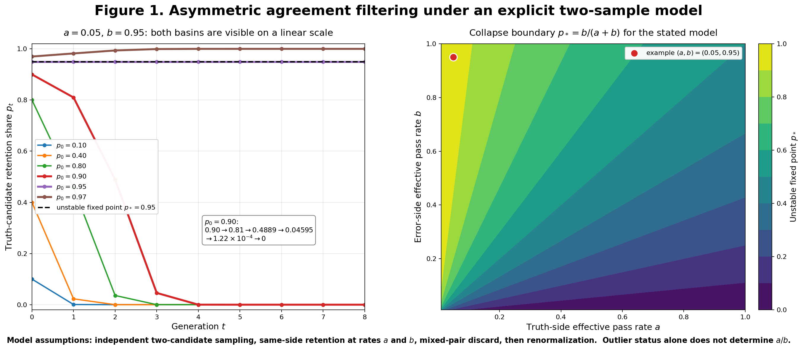
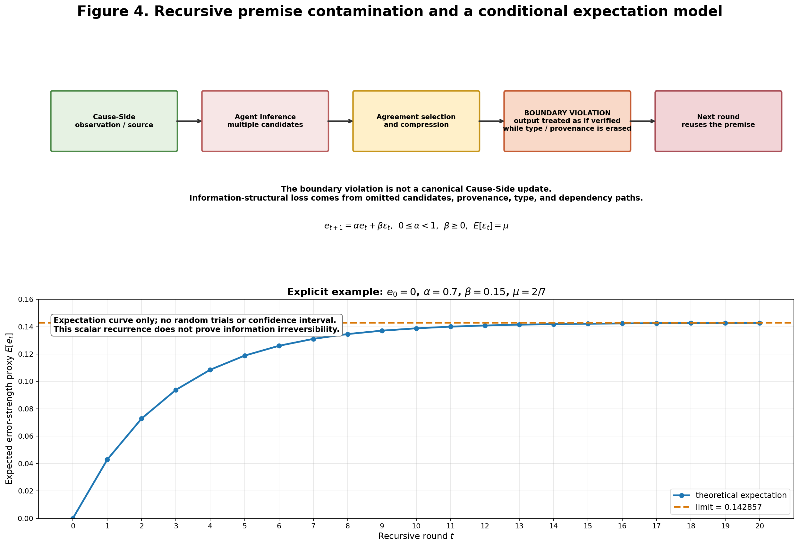
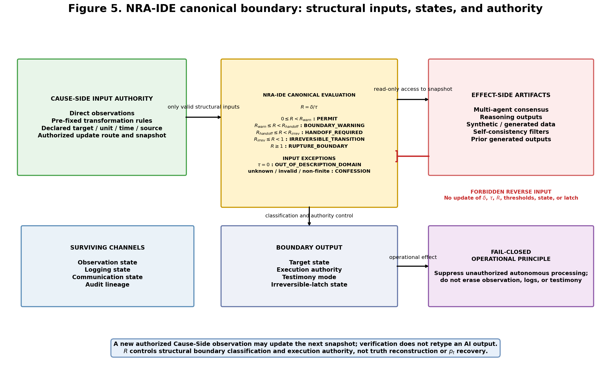
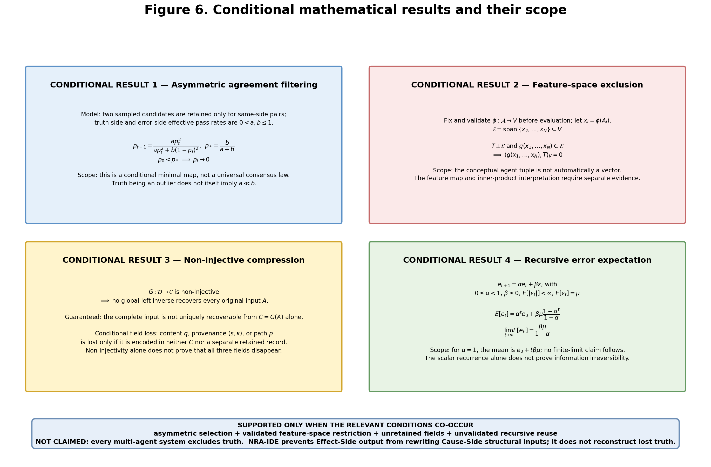

<!-- filename:MultiAgent_Truth_Exclusion_Paper_26-0821-2004_EN.md -->
<!-- generated: 2026-08-21 20:04 JST -->

# The Truth-Candidate Exclusion Hypothesis in Multi-Agent Search
## — A Conditional Mathematical Structure of Truth Exclusion via Agreement Selection, Information Compression, and Recursive Premise Formation —

©M-Tokuni 2026　Author: M-Tokuni

---

## Abstract

Running multiple AI agents in parallel is expected to widen the search space and let the agents mutually correct one another's errors. This expectation, however, depends on several conditions holding at once: that errors across agents are sufficiently independent, that truth candidates survive to the consensus stage, and that the consensus result is not promoted to the next stage's "fact" without external verification.

This paper does not claim the general proposition that "multi-agent systems themselves erase the truth." It addresses a conditional hypothesis: only when the following three operations are chained together can a truth candidate that exists as a minority be excluded from the search space.

1. Making agreement / agreement-rate the primary selection criterion
2. Compressing the multi-dimensional state of multiple agents into a single or low-dimensional decision, without retaining rejected candidates, provenance, or reasoning paths
3. Re-injecting the compressed decision result as the premise for the next round of search without external verification

The central claim of this paper is not a simple averaging argument in which the truth is diluted among majority errors. When a truth candidate sits in a low-agreement, low-density outlier region of the agent population's output distribution, while the error side shows high mutual agreement due to a shared bias, the agreement-selection step itself can reject the truth candidate, and the subsequent compression and recursive reuse can then erase the truth candidate's provenance.

Keywords: multi-agent consensus, information loss, provenance, recursive premise contamination, NRA-IDE

---

## 1. Introduction and Problem Setting

In multi-agent search, it is common for multiple agents to generate distinct candidates, reasoning paths, evidence, and hypotheses, which are then merged by some aggregation function into one or a small number of conclusions.

We represent agent $i$'s internal state not as a mere yes/no vote but as structured information of the following form.

$$
A_i=(Q_i,U_i,E_i,P_i,S_i)
$$

Here $Q_i$ denotes the truth-candidate / proposition candidate, $U_i$ unconfirmed information, $E_i$ error or counter-evidence candidates, $P_i$ the reasoning path / dependency, and $S_i$ the source / provenance. This tuple is a conceptual structured state, and it is not assumed by default to support vector addition, scalar multiplication, or an inner product.

Let the consensus function that aggregates the states of multiple agents be

$$
C=G(A_1,A_2,\ldots,A_N)
$$

The problem arises when $G$ does more than organize information — when it also selects, discards, and compresses candidates. In particular, if only $C$ is passed to the next stage and the original states $A_1,\ldots,A_N$ are not retained, the consensus step can become an irreversible boundary for the information obtained during search.

"Irreversible" here does not assert physical irreversibility unconditionally. In this paper it refers to an information-structural irreversibility: the original agent states cannot be uniquely recovered from the retained consensus output $C$ alone.

---

## 2. Defining Truth and Outlier Status

### 2.1 Definition of Truth

"Truth" in this paper is not defined by agreement among the agent population. It refers to a candidate that is correct with respect to a reference point external to the agent population — an externally referenceable benchmark, a primary observation, an exact solution given by the problem setting, or verified source material.

Letting the external reference be $y^*$, and defining a truth condition as the candidate $y$ lying within tolerance $\varepsilon$,

$$
|y-y^*|<\varepsilon
$$

For discrete problems, $y=y^*$ suffices. Consequently, the fact that a majority of agents produce the same answer and the fact that this answer is correct are independent judgments.

### 2.2 Definition of Outlier Status

Saying that the truth is an outlier does not mean that being correct itself implies outlier status. Letting $Q(y)$ be the output distribution of the agent population, it means that the truth $y^*$ lies away from the majority's high-density, high-agreement region.

$$
Q(y^*) \ll Q(y_{\mathrm{mode}})
$$

or, using an agreement score $S(y)$, a state in which $S(y^*)<S(y_E)$ relative to a shared error candidate $y_E$.

What matters is that outlier status is not synonymous with a low agreement rate among the truth-holding agents themselves. If multiple agents can independently and correctly reference the same primary observation, the agreement rate among the truth-holders can be high even while the truth remains a minority in the overall distribution. This paper therefore treats outlier status ("the truth is a minority") separately from the coefficient $a$ introduced below (a distinct variable representing which side agreement selection tends to retain).

---

## 3. Central Hypothesis

We define the hypothesis of this paper with the following qualifications.

> **Agreement-Filtered Multi-Agent Truth Exclusion Hypothesis**
> When multiple agents share a common error structure, when the selection of search candidates depends more strongly on inter-agent agreement than on external correctness verification, and when rejected candidates, provenance, and reasoning paths are not retained at compression time, a truth candidate existing as a minority can be excluded by consensus compression. Furthermore, if the compressed result is reused as the premise for the next generation without external verification, a recursive premise contamination can occur in which the truth candidate is lost from the input set of subsequent search.

This hypothesis is not the general proposition

$$
\text{Multi-Agent} \Rightarrow \text{Truth Loss}
$$

What matters is the following chain:

$$
\text{Parallel Search}
\rightarrow
\text{Agreement Selection}
\rightarrow
\text{Candidate Discard}
\rightarrow
\text{Compression}
\rightarrow
\text{Decision Reification}
\rightarrow
\text{Recursive Reuse}
$$

In particular, the last two stages — treating the decision result as fact, and passing only that result to the next stage — turn a single wrong answer into historical premise contamination.

---

## 4. The Asymmetric Agreement Filter Model

### 4.1 Update Rule and Odds-Ratio Transformation

Let $p_t$ denote, at generation $t$, the fraction of retained candidates on the truth side. We assume a minimal model in which, at each generation, two candidates are drawn independently; truth-side pairs are retained at effective rate $a$, error-side pairs at effective rate $b$, mixed truth/error pairs are discarded, and the retained same-side pairs are then renormalized by their total mass. Under this model alone, the unnormalized truth-side retained mass is $ap_t^2$ and the error-side mass is $b(1-p_t)^2$, giving the following update rule.

$$
p_{t+1}
=
\frac{a p_t^2}
{a p_t^2+b(1-p_t)^2}
\qquad (0<a\leq1,\ 0<b\leq1)
$$

This equation is not a claim that every real multi-agent system behaves according to it. It is a conditional minimal map representing the asymmetry of agreement selection, valid only under the stated assumptions of two-candidate sampling, same-side retention, mixed-pair discard, and renormalization.

For $0<p_t<1$, defining the odds ratio $r_t=p_t/(1-p_t)$, the update rule gives

$$
r_{t+1}
=
\frac{a}{b}r_t^2
$$

Iterating this yields

$$
r_t
=
\left(\frac{a}{b}\right)^{2^t-1}
r_0^{2^t}
$$

The endpoints $p_t=0,1$ are treated as fixed points of the original update rule. This squaring iteration produces rapid collapse on one side of the threshold, and rapid amplification on the other.

### 4.2 Fixed Points and the Collapse Condition

The fixed points are $p=0$, $p=1$, and the interior unstable fixed point

$$
p_*=\frac{b}{a+b}
$$

In terms of the odds ratio, the boundary value is $r_*=b/a$. Hence,

$$
p_0<p_*
\quad\Longleftrightarrow\quad
r_0<\frac{b}{a}
\quad\Longrightarrow\quad
p_t\rightarrow0
$$

Conversely, $p_0>p_*$ drives $p_t\rightarrow1$.

When $a\ll b$ — that is, when the error side passes the agreement filter overwhelmingly more easily than the truth side — $p_*=b/(a+b)\approx1$. Figure 1 shows the collapse trajectory for $a=0.05$, $b=0.95$ ($p_*=0.95$), together with a phase diagram of $p_*$ over the $(a,b)$ plane.

**Figure 1. Asymmetric agreement filtering: conditional dynamics and the collapse boundary.** The left panel shows the same-side two-candidate retention model for $a=0.05$, $b=0.95$ on a linear scale. Trajectories with $p_0<p_*=0.95$ tend to zero, those with $p_0>p_*$ tend to one, and $p_0=p_*$ remains at the unstable fixed point. In particular, $p_0=0.90$ evolves as $p_1=0.81$, $p_2\approx0.4889$, $p_3\approx0.04595$, $p_4\approx1.22\times10^{-4}$. The right panel is a contour plot of $p_*=b/(a+b)$ over the $(a,b)$ plane. The fact that "the truth is an outlier" does not by itself imply $a\ll b$.

What this model shows is not that "90% was correct but lost the majority vote." It shows that when the pass rate of agreement selection is markedly asymmetric between the truth side and the error side, an early majority on the truth side alone cannot guarantee its retention.

### 4.3 Independence of Effective Agreement Rate and Outlier Status

The following inference does not hold.

$$
\text{Truth is outlier}
\Rightarrow
a\ll b
$$

$a$ is the effective rate at which truth-side candidates are retained through agreement selection, and it is a variable independent of outlier status (being a minority in the distribution). For example, if the multiple agents holding the truth candidate reference the same physical sensor, the same primary source, or the same exact computation, $a\approx1$ can hold even while the truth candidate is a minority. Conversely, if the truth is distributed across several distinct representations and reasoning paths while only the error side shares a common template, a common foundation model, a common RAG source, or a common upstream output, $a<b$ can hold.

---

## 5. Selection and Projection: A Mechanism Other Than Averaging

Explaining the phenomenon as "combining multiple agents averages things out and dilutes the truth" is not sufficient. Under simple averaging, as long as the truth candidate numerically contributes to the mean, its component generally does not vanish.

What this paper is concerned with is the case where the consensus function $G$ acts as

$$
G=\text{select-high-agreement candidates}
\qquad\text{or}\qquad
G=\text{project onto dominant shared mode}
$$

that is, the case where $G$ adopts only the agreeing candidates rather than retaining all candidates with equal weight. In this case, the truth is not diluted — it falls outside the adopted set. This paper therefore treats the central phenomenon not as dilution through averaging, but as Agreement-Driven Selection or Mode/Subspace Selection.

---

## 6. Exclusion of the Truth Component by Projection onto the Error Subspace

Let $\mathcal{A}$ denote the set of all agent states, and let a feature map fixed in advance, mapping the features compared in this section into a real inner-product space $V$, be

$$
\phi:\mathcal{A}\rightarrow V
$$

Set $x_i=\phi(A_i)$, and let the feature subspace of the error candidates be

$$
\mathcal{E}=\mathrm{span}\{x_2,\ldots,x_N\}\subseteq V
$$

(a script $\mathcal{E}$ is used for the subspace to make clear that it is distinct from the component label $E_i$). Suppose the truth component $T\in V$ in feature space satisfies $T\perp\mathcal{E}$, and suppose the output of the consensus map $g:V^N\rightarrow V$ in feature space is restricted to lie inside the error subspace, i.e. $g(x_1,\ldots,x_N)\in\mathcal{E}$. Then, for any consensus output $c=g(x_1,\ldots,x_N)$ in feature space,

$$
\langle c,T\rangle_V=0
$$

Hence $c$ has no component in the direction of $T$. This is a conditional lemma: under a feature map and inner product fixed in advance, if the consensus map's output is restricted to the shared error subspace and the truth component lies orthogonal to it, then the truth component is excluded from the consensus output in feature space. This conclusion cannot be drawn merely from orthogonality $\langle T,B\rangle_V=0$ to a single shared bias vector $B$, because individual error candidates may have components in directions other than $B$, and those directions might include a component along $T$. Moreover, the validity of the feature map $\phi$ does not follow from this lemma itself and must be separately verified for each target problem. The essential point here is not that the truth vanishes automatically because it is an outlier, but that, in a defined feature space, the consensus operation restricts its output to the error-side subspace.

Figure 2 shows a schematic example, arranging a single truth candidate and a cluster of candidates sharing an error side along a one-dimensional axis, to illustrate this structure. This figure is not a Monte Carlo experiment nor an estimate of a general recovery probability.

**Figure 2. Schematic example of a shared error cluster and truth-candidate exclusion.** A single configuration is shown in which the truth candidate sits at the origin while the other candidates cluster in a high-agreement region on the shared error side. If the consensus rule adopts only the high-agreement region and does not retain the truth candidate through a separate channel, the truth candidate falls outside the adopted set. This figure illustrates one possible geometric configuration; it does not measure an occurrence probability, a general recovery rate, performance change with agent count, or real inter-agent error correlation.

---

## 7. Many-to-One Compression and Non-Recoverability of Information

Suppose each agent holds a structured state, and the $N$ of them are aggregated as

$$
A=(A_1,\ldots,A_N)\in\mathcal{D}
$$

Let the consensus function be $G:\mathcal{D}\rightarrow\mathcal{C}$. If $\mathcal{C}$ is a binary decision such as $\{0,1\}$, $G$ is in most cases a many-to-one map.

If $G$ is non-injective, then

$$
\exists A\neq A'
\quad\text{such that}\quad
G(A)=G(A')
$$

In this case, there is no inverse function $H:\mathcal{C}\rightarrow\mathcal{D}$ satisfying $H(G(A))=A$ for every $A$ that fully recovers every input. Hence, if only the consensus result $C$ is retained, the original agent states cannot be uniquely recovered.

Note that the intuitive argument "50 input components and 1 output component means 49 dimensions of information must be lost" is not a rigorous general proof of the amount of information lost, because the meaning of information quantity depends on whether the setting is discrete or continuous, on encoding, on constraint sets, and on the shape of the map. What this paper needs is the weaker but certain statement that a non-injective consensus compression cannot uniquely recover the original state from the consensus result alone.

However, non-injectivity alone does not let us conclude that all three of content, provenance, and reasoning path are lost. What non-injectivity directly guarantees is only that at least two distinct inputs map to the same output and that no complete left inverse exists for all inputs. Individual information losses are conditional: content is lost only if it is not encoded in the retained output or a separate record; provenance is lost only if it is not so encoded; and structure is lost only if the reasoning path is not so encoded. Asserting each specific loss therefore requires separately confirming that the corresponding field is absent from both the output and any external retention system.

Figure 3 diagrams, separately, the complete non-recoverability that necessarily follows from non-injectivity, and the three kinds of loss that arise only under the additional condition of non-retention.

**Figure 3. Non-injective consensus compression and conditional loss.** The figure shows the process by which the states of $N$ agents are compressed by the consensus function $G$ into a single decision $C$. If $G$ is non-injective, there is no complete inverse map that uniquely recovers every original input from $C$ alone. Which of content, provenance, or structure is actually lost depends on whether the corresponding field is encoded in $C$ or in a separately retained record. This is neither the numerical claim that "$N\times d-1$ dimensions are necessarily lost" nor the claim that all three kinds of loss always occur simultaneously.

---

## 8. Three Categories of Loss: Content, Provenance, and Structure

Calling the truth-candidate exclusion of multi-agent systems a single undifferentiated "information loss" obscures what was actually lost and where. Represent one piece of information held by an agent as

$$
z=(q,s,p,\kappa)
$$

where $q$ is the propositional content, $s$ is the source/provenance, $p$ is the dependency path that led to the proposition, and $\kappa$ is the epistemic type — observation, primary source, inference, or consensus-generated, etc.

**Content Loss** occurs when $q$ itself is not included in the compressed result $C$ and is not retained in any separate record, so that downstream stages cannot directly reference the original truth candidate. **Provenance Loss** occurs when the wording of $q$ survives but $s$ and $\kappa$ are present in neither $C$ nor any separate record — for example, if "a value obtained from sensor observation" and "a value estimated by an upstream AI" collapse into the same string, downstream stages cannot distinguish between them. **Structural Loss** occurs when the dependency path $p=(x_0\rightarrow x_1\rightarrow\cdots\rightarrow q)$ that led to $q$ is present in neither $C$ nor any separate record, so downstream stages cannot determine which premise to retract in order to withdraw the conclusion.

These three are distinct losses. In particular, even if the same correct text is regenerated later, this does not mean the original information $z$ has been recovered if the original $s$ and $p$ remain lost. This distinction matters for separating the reappearance of content from the recovery of grounded information.

---

## 9. Recursive Premise Contamination

### 9.1 The Decision-to-Premise Conversion

Let the consensus output at time $t$ be

$$
C_t=G(A_1^{(t)},\ldots,A_N^{(t)})
$$

If the next generation of agents receives this $C_t$ as a premise without external verification, then $D_{t+1}=F(C_t)$. Here, $C_t$ was originally a decision generated on the Effect-Side, but at the next stage it risks being treated like an already-known Cause-Side fact. We call this type conversion

$$
\text{Decision}
\rightarrow
\text{Premise}
$$

### 9.2 Dropping the Truth Candidate from the Input Set

Let the search set at generation $t$ be $\Omega_t$ and the truth candidate be $T$. Even if $T\in\Omega_t$ initially, letting $\rho_t$ denote the retained set after consensus compression, it can happen that $T\notin\rho_t$ (the retained set is denoted $\rho$, not $R$, to make clear that it is a quantity distinct from the NRA-IDE structural ratio $R=\delta/\tau$). If the next generation searches using only $\rho_t$ as input, $\Omega_{t+1}=F(\rho_t)$. If there is then no channel to reinject $T$ from outside, and if $F$ does not newly acquire grounds for the truth beyond the provenance of the retained information, the original grounded truth candidate is absent from the next stage's input.

It should be noted that this does not rule out the possibility that an LLM happens to regenerate the same answer string later. Strictly speaking, then, the claim is not that "the same string never reappears," but that there is no longer any guarantee of recovering the lost truth candidate, together with its original provenance and reasoning path, from the internal state alone.

### 9.3 A Recursive Error Model

Simplifying the recursive contamination and letting the error strength be $e_t$,

$$
e_{t+1}=\alpha e_t+\beta\varepsilon_t
$$

where $\alpha$ is the carry-over rate of the previous generation's error, $\beta$ is the scaling of the new error, and $\varepsilon_t$ is the random variable of the new error. In this section we assume $0\leq\alpha<1$, $\beta\geq0$, $E[|\varepsilon_t|]<\infty$, and that $\varepsilon_t$ are i.i.d. with $E[\varepsilon_t]=\mu$, giving

$$
E[e_t]
=
\alpha^t e_0
+
\beta\mu\frac{1-\alpha^t}{1-\alpha}
$$

$$
\lim_{t\rightarrow\infty}E[e_t]
=
\frac{\beta\mu}{1-\alpha}
$$

For example, with $e_0=0$, $\alpha=0.7$, $\beta=0.15$, $\varepsilon_t\sim\mathrm{Beta}(2,5)$ (so $\mu=2/7$), the expectation increases from zero and its limit is $\beta\mu/(1-\alpha)=1/7\approx0.142857$. The formula $\beta/(1-\alpha)=0.5$ holds only under the implicit assumption $E[\varepsilon_t]=1$, so $\mu$ must not be dropped in a model that includes the random variable $\varepsilon_t$. At $\alpha=1$, $E[e_t]=e_0+t\beta\mu$, and for $\alpha\geq1$ within the non-negative coefficient range of this section, the above finite limit generally does not hold.

Importantly, this scalar recurrence by itself does not prove the irreversibility of information loss: if $\alpha\neq0$ and $\varepsilon_t$ is known, one can numerically back-solve $e_t=(e_{t+1}-\beta\varepsilon_t)/\alpha$. The root of the irreversibility discussed in this paper is therefore not the scalar error recurrence, but the combination

$$
\boxed{
\text{Candidate Discard}
+
\text{Provenance Erasure}
+
\text{Many-to-One Compression}
+
\text{Decision Reification}
}
$$

Figure 4 shows this mechanism together with the saturating behavior of the stochastic drift model.

**Figure 4. Recursive premise contamination: mechanism and a conditional expectation model.** The upper panel shows the failure path from Cause-Side observation, through agent inference and consensus, to a premise formation step that erases the provenance type, followed by reuse at the next stage. This "treatment as a Cause-Side fact" is not a type conversion permitted by NRA-IDE; it is a schematic of a boundary violation. The structural non-recoverability arises from discarded candidates, erased provenance, erased epistemic type, and erased dependency paths. The lower panel shows the theoretical expectation curve for $e_0=0$, $\alpha=0.7$, $\beta=0.15$, $\mu=2/7$; it is not a random-simulation result. This scalar recurrence, by itself, does not prove the irreversibility of information loss.

---

## 10. The Role of Agent Count and Error Correlation

The claim that increasing the number of agents worsens accuracy cannot be made a general proposition. When each agent's errors are sufficiently independent, when each agent has even a slight advantage on the truth side, and when the aggregation rule can exploit that independence, there are situations in which increasing the agent count $N$ improves accuracy.

What this paper is concerned with is not majority voting among independent agents, but the case where inter-agent error correlation $\rho_{ij}>0$ exists and shared errors are favored by agreement selection. If additional agents share the same foundation model, the same training distribution, the same RAG source, the same search results, the same upstream consensus result, or the same evaluation rule, then increasing the agent count $N$ is not adding independent verifiers — it can amount to adding more votes of agreement to a shared bias. What should be evaluated, therefore, is not agent count itself but independence, error correlation, diversity of information sources, and the selection rule.

---

## 11. Separating Search from Consensus

Parallel search by multiple agents has, in itself, the benefit of widening the possibility of discovering a truth candidate. The problem lies in how the candidates obtained through search are subsequently handled. Multi-Agent Search and Multi-Agent Consensus must not be equated.

During the search stage, there is value in retaining mutually contradictory candidates. But if the consensus stage imposes the rule that "a candidate that does not agree with others is noise," the diversity gained through search is discarded by the system itself. In particular, when the truth is a minority, a paradox can occur in which higher search performance means the truth candidate is discovered at least once, only to be lost afterward through consensus compression. Evaluating multi-agent systems by discovery rate alone is therefore insufficient; the following chain of stages must be evaluated:

$$
\text{Discovery}
\rightarrow
\text{Retention}
\rightarrow
\text{Provenance Preservation}
\rightarrow
\text{External Verification}
$$

---

## 12. Connection to NRA-IDE: The Cause-Side / Effect-Side Boundary

For this problem, it is not appropriate to position NRA-IDE as a device that automatically generates the truth, or as a general-purpose fact verifier. The canonical role of NRA-IDE is to evaluate structural state from Cause-Side observations, or from Cause-Side transformation rules fixed before evaluation, and to prevent structural variables, thresholds, boundary states, and the irreversible latch from being rewritten by Effect-Side output. The canonical prohibition can be written as

$$
\text{Effect-Side Output}
\not\Rightarrow
\text{Cause-Side Structural Input}
$$

A canonical Cause-Side observation requires traceability of the target, unit, observation time, source, update authority, and the pre-fixed rule applied. A primary source, an external reference, an audit log, or a cryptographic verification result can support the provenance, record, and integrity of an observation, but none of these by itself constitutes a canonical Cause-Side observation or content-level truth. Human approval can fix update authority and rules, but it does not by itself type-convert Effect-Side output into a Cause-Side observation. LLM inference, agent consensus, self-consistency filters, synthetic data, and upstream AI outputs retain their own provenance type even after being screened or verified. When an independent, authorized new Cause-Side observation is obtained, that new observation forms the next evaluation snapshot according to a fixed route and fixed rules.

Most importantly,

$$
C_t
\not\Rightarrow
D_{t+1}^{\mathrm{fact}}
$$

is a derived prohibition obtained by applying NRA-IDE's No Reverse-Flow to the epistemic-type management discussed in this paper. That is, the consensus result $C_t$ at time $t$ must not be unconditionally type-converted into a confirmed fact at the next stage. Even when reused, its provenance type is retained, e.g. as $\kappa(C_t)=\texttt{agent\_generated}$ or $\kappa(C_t)=\texttt{consensus\_generated}$. This derived type management does not imply that the canonical $R$ is a general truth score or fact-promotion score.

The role of NRA-IDE is not to recover lost truth from within the Effect-Side, but to withhold from Effect-Side output the authority to update Cause-Side structural variables. In application, this paper's stance is that a consensus output whose truth candidate or grounds may have been lost is not treated as confirmed fact, but is reused while retaining its provenance type. Furthermore, because consensus is a many-to-one compression under which provenance and reasoning path can be lost, before beginning inference one needs an Origin Recoverability that keeps, through a separate channel, a reference path from the current decision back to the original Cause-Side observation and audit record. Origin recovery means returning directly to a retained external reference record, not reconstructing it through inference:

$$
\text{Reasoning Reconstruction}
\neq
\text{Origin Recovery}
$$

Figure 5 diagrams this boundary structure.

**Figure 5. NRA-IDE boundary architecture: Cause-Side / Effect-Side separation.** Only canonical Cause-Side observations and pre-fixed transformation rules serve as evaluation inputs for the accumulated deviation $\delta$, the absorption thickness $\tau$, and the structural ratio $R=\delta/\tau$. The Effect-Side (multi-agent consensus, reasoning output, synthetic data, etc.) may reference the Cause-Side snapshot but does not update $\delta$, $\tau$, $R$, the thresholds, the boundary state, or the irreversible latch. The known $R$ progression separates `PERMIT`, `BOUNDARY_WARNING`, `HANDOFF_REQUIRED`, `IRREVERSIBLE_TRANSITION`, and `RUPTURE_BOUNDARY`. Separately, $\tau=0$ is treated as `OUT_OF_DESCRIPTION_DOMAIN`, and unknown, invalid, ambiguous, or non-finite structural input is treated as `CONFESSION`; these are not conflated with the known $R$ progression. Even under `RUPTURE_BOUNDARY`, surviving observation, logging, and communication channels are not equated with a rupture of the target itself. Fail-Closed is not a latch or a canonical state name; it is an operational principle that suppresses unauthorized autonomous processing by default. $R$ is not a quantity that reconstructs lost truth or recovers $p_t$ (a quantity distinct from the retained set $\rho_t$ in Section 9.2 of this paper).

---

## 13. Summary of Mathematical Results

Within the scope of this paper, once the conditions are stated explicitly, the following points can be shown mathematically.

1. **Collapse boundary of the asymmetric agreement filter**: for $p_{t+1}=ap_t^2/(ap_t^2+b(1-p_t)^2)$, $p_*=b/(a+b)$ is the interior unstable fixed point, and $p_0<p_*\Rightarrow p_t\rightarrow0$. However, outlier status does not imply $a\ll b$.
2. **Exclusion of the truth component by consensus restricted, in feature space, to the error subspace**: for a pre-fixed $\phi:\mathcal{A}\rightarrow V$, let $x_i=\phi(A_i)$ and $\mathcal{E}=\mathrm{span}\{x_2,\ldots,x_N\}$. If $T\perp\mathcal{E}$ and $g(x_1,\ldots,x_N)\in\mathcal{E}$, then $\langle g(x_1,\ldots,x_N),T\rangle_V=0$. The validity of $\phi$, however, requires separate verification.
3. **Complete non-recoverability from non-injective compression**: if $G$ is non-injective, there is no inverse function that uniquely recovers every original state $A$ from $G(A)$ alone. The individual losses of content, provenance, and reasoning path, however, each apply only when the corresponding field is encoded in neither the output nor a separate record.
4. **Expectation of the recursive error**: for $0\leq\alpha<1$, $\beta\geq0$, $E[|\varepsilon_t|]<\infty$, $E[\varepsilon_t]=\mu$, $E[e_t]=\alpha^te_0+\beta\mu(1-\alpha^t)/(1-\alpha)$, with limit $\beta\mu/(1-\alpha)$. This recurrence alone, however, does not prove irreversibility.

Figure 6 summarizes these four conditional results, together with the limits of their applicability, on a single page.

**Figure 6. Mathematical summary of the conditional truth-exclusion mechanism.** For each result, the model conditions, feature-space conditions, non-retention conditions, and convergence conditions are stated together. The claims supported are conditional, not universal. Truth-candidate exclusion can occur when agreement selection is asymmetric, when consensus in a validated feature space is restricted to a shared error subspace, when the necessary candidates, provenance, or paths are not retained elsewhere, and when the compressed decision is reused as a premise without external re-verification. This is not the claim that every multi-agent system erases the truth.

---

## 14. Scope and Limitations

The following claims do not, in general, follow from the mathematics in this paper alone.

- **Every multi-agent system erases the truth**: independent verification sources, preservation of truth candidates, external reference, and different aggregation rules change the outcome.
- **If the truth is an outlier, $a\ll b$ necessarily holds**: outlier status and the effective agreement rate are independent variables.
- **An inner product can automatically be applied to a conceptual agent state**: the subspace lemma requires a pre-fixed feature map, a real inner-product space, and independent grounds for the validity of that map.
- **Accuracy necessarily worsens as agent count increases**: this depends on error independence and each agent's individual performance.
- **Once content is lost, the same correct text is never generated again**: a generative model can regenerate the same string by chance, but unless that regeneration carries the original primary information, observation, source, and reasoning path, it does not amount to recovering the original grounded truth information.
- **A scalar error recurrence alone proves irreversibility**: irreversibility must be argued through the combination of candidate discard, many-to-one compression, provenance erasure, and type erasure.
- **The expectation of the recursive error unconditionally converges to a finite value**: the limit formula in this paper requires $0\leq\alpha<1$ and a finite-expectation assumption.

---

## 15. What to Measure in Implementation Verification

When conducting implementation verification, at minimum the following states should be recorded separately, not just the final accuracy rate.

1. Whether each agent generated the truth candidate at least once
2. Whether the truth candidate remained in the consensus input
3. Whether the truth candidate remained in the consensus output
4. Whether the truth candidate's provenance remained
5. Whether the truth candidate's reasoning dependency remained
6. What epistemic type the consensus result was treated as at the next stage
7. Whether an external Cause-Side reference was re-executed
8. Whether a rejected candidate can be re-audited afterward

In particular, $\text{discovered}\neq\text{retained}$, and $\text{retained text}\neq\text{retained provenance}$. The mere fact that some agent produced the truth once does not mean the system, as a whole, retained the truth.

---

## 16. Conclusion

If the risk of multi-agent search is reduced to the level of "majority voting can be wrong," the essence of the problem is missed. The problem is that a truth candidate that did exist can be rejected by Agreement Selection, can have its candidate identity, provenance, and reasoning path dropped by Many-to-One Compression, and — through the Decision→Premise type conversion — the compressed result alone can go on to form the next stage's search space. In this case the truth is not necessarily left thinly present; the truth candidate itself can fall out of the next stage's input, moving the system into a state where downstream agents no longer hold that candidate for comparison.

This must not, however, be extended into an unconditional universal theorem. What this paper has shown is that truth-candidate exclusion can occur structurally when the following conditions coincide: an asymmetric agreement pass rate between the truth side and the error side; consensus biased toward a shared error subspace; non-injective compression; failure to preserve provenance and reasoning path; and promotion of the compressed result to the next-stage premise without external verification.

The core countermeasure, therefore, is not merely searching for a smarter majority vote. What is needed is a structure that preserves the original states — including minority candidates obtained through search — that separates the types of observation, primary source, inference, and consensus result, that does not promote Effect-Side consensus output to Cause-Side fact without verification, and that can always return to an external reference point when necessary. In that sense, the most critical challenge in multi-agent search is not accuracy alone, but preserving the entire chain

$$
\text{Truth Discovery}
\rightarrow
\text{Truth Retention}
\rightarrow
\text{Provenance Preservation}
\rightarrow
\text{Origin Recoverability}
$$

without breaking it. Discovering the truth once, and not losing that truth within the system's history, are different problems.

---

©M-Tokuni 2026　Author: M-Tokuni
