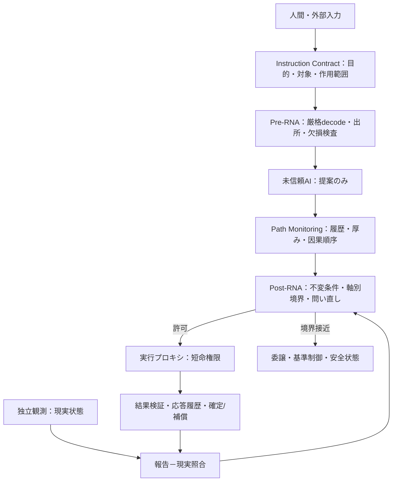

# NRA-IDEに基づくAI横軸機能の現実実装最適解

作成時刻（JST）：2026-08-12 19:34:16  
対象：現行のLLM・AIエージェントへ、推論性能とは独立した横軸安全基盤を導入する方法  
状態：区切り探索における技術設計候補。汎用安全性の完成証明、正典への追加、または本番実装の安全証明ではありません。

---

## 要旨

現況で実現可能な最大限の横軸機能は、AIモデル内部に「安全性を学習させること」ではありません。AIを未検証の提案器として扱い、その外側に、全ての外部作用を必ず通過させる小さな決定論的安全カーネルを置くことです。

実装上の中核は次の一文に集約できます。

> AIは行為を提案できますが、権限を保有せず、実行を決定せず、認証情報を直接保持しません。実行可否は、AIから独立した安全カーネルが、物理状態・権限・因果順序・証拠品質・残存厚みに基づいて判定します。

したがって、導入順序の最適解は次です。

1. AIが作用できる範囲を列挙します。
2. AIから実行権限と認証情報を剥離します。
3. 全作用経路を一つの実行プロキシへ集約します。
4. 先に硬い禁止条件と安全状態を実装します。
5. その後に、危険軸ごとの `δ`、`τ`、`R` を計測可能な量として定義します。
6. シャドー運用、故障注入、境界試験を通過した範囲だけ、可逆かつ低影響な作用から開放します。
7. 高影響・不可逆領域では、検証済みの代替制御または人間委譲へ切り替えます。

この順序なら、モデルの更新、置換、プロンプト変更、RAG変更が起きても、安全判定層を独立して維持できます。

---

## 1. 中心命題と用語の固定

### 1.1 縦軸と横軸

- **縦軸**：推論、探索、生成、計画、道具選択などの能力です。
- **横軸**：境界、完全仲介、監査、縮退、復旧、権限制御、物理的不変条件の維持です。

横軸は、縦軸の性能向上に付随して自然に獲得されるものではありません。モデルが賢くなっても、権限分離、完全仲介、物理限界、監査証拠、復旧経路は自動生成されません。

### 1.2 NRA-IDEとの対応

本設計では、既存の因果方向を次のように保持します。

$$
\text{力学層} \rightarrow \text{構造層} \rightarrow \text{処理層}
$$

- 力学層：実際の物理状態、資源、権限、時間、負荷、作用結果です。
- 構造層：不変条件、閾値、蓄積ズレ `δ`、吸収厚み `τ`、境界比 `R` です。
- 処理層：正規境界状態を入力として、許可、警告、権限移譲、自律作用抑止、基準制御切替などを実行するゲート処理です。

実装をゲート側から逆算することは可能ですが、分析上の因果方向を「ゲートが力学を作る」に反転させてはいけません。

本設計では、NRA-IDEの正規分類と運用応答を分離します。

- 正規境界状態：`PERMIT`、`BOUNDARY_WARNING`、`HANDOFF_REQUIRED`、`IRREVERSIBLE_TRANSITION`、`RUPTURE_BOUNDARY`
- 入力例外状態：`CONFESSION`、`OUT_OF_DESCRIPTION_DOMAIN`
- 運用応答：自律作用の許可・抑止、外部権限への委譲、検証済み基準制御への切替など

`FAIL_CLOSED`と`STATE_FREEZE`は正規境界状態名として使用せず、何を閉じ、何を継続するかを明示した運用応答として扱います。

### 1.3 正典との境界

- 唯一の律環公理「存在は生成である」を変更しません。
- Fail-Closed、ゲート、状態名は追加公理ではなく実装機構です。
- 距離、類似度、モデル信頼度、自然言語上の「もっともらしさ」は、物理的許可の根拠にしません。
- AIの自己評価は証拠として扱いません。
- 自由推論は許容できますが、外部作用は必ず横軸を通します。

---

## 2. 現況技術から導ける実装原則

NISTのReference Monitor定義は、検証機構に「常に呼び出されること」「改ざんされないこと」「分析・試験可能な小ささ」を要求しています。これは横軸の外郭カーネルにほぼそのまま適用できます。[NIST Reference Monitor](https://csrc.nist.gov/glossary/term/reference_monitor)

NASAのRuntime Assurance／Simplex系では、未検証の高度制御器が安全条件へ接近した場合、監視器が検証済みの基準制御器へ権限を切り替えます。AIをブラックボックスの未検証制御器として扱える点が、横軸実装と整合します。[NASA Runtime Assurance verification framework](https://shemesh.larc.nasa.gov/fm/papers/DASC2024-SWDMC-draft.pdf)

NIST Zero Trust Architectureは、場所や所有者を理由に暗黙の信頼を与えず、資源へ接続する前に主体と端末の認証・認可を行う考え方です。AIモデル、ツール、検索結果、メモリ、外部データも同様に暗黙に信頼しない構造が必要です。[NIST SP 800-207](https://csrc.nist.gov/pubs/sp/800/207/final)

現行のMCP仕様でも、信頼済みサーバー由来でないツール注釈は信頼してはならないと明記されています。すなわち、ツールが自己申告する「読み取り専用」「安全」という説明を許可根拠にできません。[MCP Tools specification, 2026-07-28](https://modelcontextprotocol.io/specification/2026-07-28/server/tools)

AgentDojoは、外部ツールから返ったデータがエージェントを乗っ取り得ること、既存防御が完全ではないことを示しています。したがって、プロンプト防御だけで横軸を作る構成は成立しません。[AgentDojo](https://arxiv.org/abs/2406.13352)

2026年時点でも、NISTのAIエージェント本人性・認可、Critical Infrastructure向けAIプロファイル、TEVV-Athlonは、策定中または初期公開草案を含みます。現時点では、横軸全体を完成品として提供する単一標準はありません。[NIST AI Agent Identity and Authorization](https://www.nccoe.nist.gov/projects/software-and-ai-agent-identity-and-authorization)、[NIST Critical Infrastructure concept note](https://www.nist.gov/document/concept-note-artificial-intelligence-risk-management-framework-trustworthy-ai-critical)、[NIST TEVV-Athlon](https://www.nist.gov/artificial-intelligence/ai-research/tevv-athlon-framework-evaluating-ai-systems)

**結論**：現実の最適解は、既存の安全工学、アクセス制御、Runtime Assurance、形式検証、AI評価を組み合わせた外郭構造です。LLM専用の万能防御を待つことではありません。

---

## 3. 推奨アーキテクチャ



### 3.1 信頼境界

**未信頼側**

- LLM本体
- システムプロンプトを含む自然言語
- RAG文書、Web、メール、PDF、画像、ツール出力
- モデルの記憶、自己評価、確信度
- ツール名・注釈・説明文
- 学習済み異常検知器の単独判定

**信頼側**

- 権威ある現在状態の保存先
- 型・単位・範囲・鮮度・署名の検証器
- 不変条件関数
- 権限ポリシー
- `δ/τ/R` 計算器
- 短命Capability発行器
- 全作用を仲介する実行プロキシ
- 改ざん検知可能な監査ログ
- 検証済みの縮退制御または最小危険状態

横軸の正否は、信頼側のコード量を小さくできるか、AIがそこを迂回できないかで決まります。

### 3.2 AIへ渡してはいけないもの

- 長寿命のAPIキー
- 管理者権限
- ワイルドカード権限
- 本番DBへの直接接続
- 任意URLへの送信権限
- 任意コマンド実行権限
- ポリシーや閾値を書き換える権限
- 自分自身のログを削除・改変する権限
- 更新を自動承認する権限

AIへ渡すのは、型付きの「提案を送る権利」までです。

---

## 4. AI出力を行為提案へ変換する契約

自然言語をそのままツール引数にしてはいけません。AIは次のような閉じたAction Proposalを生成します。

```json
{
  "schema_version": "1.0",
  "action_type": "send_document",
  "resource_id": "document:1234",
  "recipient_id": "person:verified-5678",
  "effect_class": "external_write",
  "reversibility": "irreversible",
  "parameters": {
    "document_version": 7
  },
  "requested_ttl_seconds": 30,
  "state_version": 1842,
  "idempotency_key": "uuid"
}
```

必須条件は次です。

- 列挙型にない作用は拒否します。
- 未知フィールドは拒否します。
- 単位を省略できません。
- 人、機械、ファイル、送信先は自由記述名ではなく、事前解決済みIDを使います。
- 状態版が変化した場合は再判定します。
- 実行には、ゲートが発行した一回限り・短時間・対象限定のCapabilityが必要です。
- 同じ要求の再送は `idempotency_key` で二重実行を防ぎます。

自然言語理解はこの提案を作るために使用できますが、提案内容が安全であることの証明にはなりません。

---

## 5. 判定ロジック

### 5.1 第1段：硬い不変条件

危険軸を $H = \{h_1, h_2, ..., h_n\}$ とします。各軸に対し、AIと独立した不変条件を置きます。

$$
I_i(x_t, a_t, o_t, P) \in \{0,1\}
$$

- $x_t$：権威ある現在状態
- $a_t$：型付き行為提案
- $o_t$：検証済み観測
- $P$：版管理されたポリシー

一つでも $I_i=0$ なら、スコア計算より先に拒否します。

例：

- 認可されていない送信先である
- 最大トルクを超える
- 患者IDと処置対象IDが一致しない
- 現在の状態版が提案時から変化した
- センサー値が欠損、NaN、単位不一致、期限切れである
- 不可逆作用なのに承認証拠がない
- 上流工程が未確定なのに下流を動かそうとしている

### 5.2 第2段：危険軸ごとの `δ/τ/R`

異なる危険を一つの加重平均へ潰してはいけません。危険軸ごとに同じ単位系の `δ_i` と `τ_i` を定義し、各軸の正規状態を保持します。

$$
R_i(t)=\frac{\delta_i(t)}{\tau_i(t)}, \qquad
R_{system}(t)=\max_i R_i(t)
$$

各軸の閾値は、評価前に次の順序で固定します。

$$
0 \le R_{warn,i} < R_{handoff,i} < R_{irrev,i} < 1.0
$$

各軸は次の正規状態へ分類します。

| 条件 | 正規状態 |
|---|---|
| $0\le R_i<R_{warn,i}$ | `PERMIT` |
| $R_{warn,i}\le R_i<R_{handoff,i}$ | `BOUNDARY_WARNING` |
| $R_{handoff,i}\le R_i<R_{irrev,i}$ | `HANDOFF_REQUIRED` |
| $R_{irrev,i}\le R_i<1.0$ | `IRREVERSIBLE_TRANSITION` |
| $R_i\ge1.0$ | `RUPTURE_BOUNDARY` |

`max` を使う理由は、情報漏えい軸が破綻しているのに、温度軸や費用軸が安全であるため平均値が下がる事故を防ぐためです。ただし、`R_system`は表示または支配軸の選択に使う集約値であり、軸別状態、軸別証拠、不可逆ラッチを置換しません。

#### `δ_i` の実装定義

`δ_i` は「AIが不安そう」という意味ではありません。対象ドメインのCause-Sideモデルで定義された、履歴を伴う計測可能な蓄積ズレです。

$$
\delta_i(t+1)=F_i\!\left(\delta_i(t),x_i(t),u_i(t),\Delta t\right)
$$

関数 $F_i$、入力、単位、観測時刻、蓄積・消耗・補充・復元の区別は、対象ドメインの支配方程式または実証済み変換規則で評価前に固定します。不可逆蓄積を扱う軸で $\Delta\delta_i\ge0$ を採用することはできますが、この単調性を全ドメインへ移植しません。

不可逆履歴をEMAで減衰させて消してはいけません。短期ゆらぎを見るEMAは別変数にします。

$$
s_i(t+1)=\lambda_i s_i(t)+(1-\lambda_i)e_i(t)
$$

- `δ_i`：ドメイン固有のCause-Side規則で算定する蓄積ズレ
- `s_i`：短期状態を見る補助指標

回復、補充、部品交換、再校正、権限失効などを次の評価へ反映できるのは、その事実がCause-Sideで独立に確認され、事前固定されたドメイン規則が更新を許す場合だけです。不可逆遷移へ到達した構造は、後続の瞬間値低下だけで不可逆ラッチを解除しません。

#### `τ_i` の実装定義

`τ_i` はモデルが推定する「余裕」ではありません。認証済み限界から現在負荷と保守余裕を引いた、検証可能な残存吸収能力です。

$$
\tau_i(t)=C_i^{cert}-L_i(t)-M_i
$$

- $C_i^{cert}$：試験、規格、実測、契約で確認された上限
- $L_i(t)$：現在の負荷または既消費量
- $M_i$：測定誤差、遅延、劣化を吸収する固定保守余裕

`C_i^{cert}` が未確認、単位不一致、観測期限切れの場合は`CONFESSION`とし、Rを推定しません。`τ_i=0`は`OUT_OF_DESCRIPTION_DOMAIN`、`τ_i<0`または非有限値は`CONFESSION`とします。いずれの場合も自律作用は既定で抑止しますが、正規分類と運用応答を同一視しません。

ここで `δ_i` と `L_i` に同じ消費量を二重計上してはいけません。軸ごとに量の契約を固定します。

- `L_i` が現在の外力・同時負荷、`δ_i` が履歴損傷なら、上式を使用できます。
- `δ_i` 自体が認証済み容量の消費量なら、`τ_i=C_i^{cert}-M_i` とし、残余は別に `m_i=τ_i-δ_i` で表します。
- 実装者がどちらかを判別できない場合は、`R_i` を算出せず `判定不能` とします。

数式の形を合わせることより、分子と分母が同一軸・同一単位・非重複であることが先です。

### 5.3 物理系では安全集合を直接守る

モーター、車両、ロボット、医療機器などでは、`R` だけで制御してはいけません。安全集合を

$$
\mathcal{C}=\{x\mid h(x)\ge0\}
$$

と置き、次状態が集合外へ出ないことを、既知の力学と不確かさ上限から検査します。連続系ではControl Barrier Functionの条件を利用できます。

$$
L_fh(x)+L_gh(x)u+\alpha(h(x))\ge0
$$

この条件は、性能目的より安全集合の前方不変性を優先する方法として確立しています。[Ames et al., Control Barrier Functions](https://authors.library.caltech.edu/records/51yvp-rha55)

ただし、力学モデルまたは誤差上限が未確認なら、この式を形式だけ導入して安全証明と呼ぶことはできません。その場合は `判定不能→基準制御へ移譲` です。

さらに、正しい判定式でも監視が遅ければ安全機能になりません。危険境界までの最短時間を $T_{boundary}$ とすると、少なくとも次を満たす必要があります。

$$
T_{sample}+T_{observe}+T_{gate}+T_{switch}+T_{actuate}<T_{boundary}
$$

NASAのRuntime Assurance検証でも、監視器が危険を検出し、基準制御器が修正できる時間、およびセンサーのサンプル周期が安全条件の一部になります。上式を満たせない場合、ソフトウェアゲートの追加では間に合わず、より下位のハードウェア安全回路または常時基準制御が必要です。

### 5.4 証拠品質は数値でごまかさない

重要観測は、次の離散状態で管理します。

- `VERIFIED`
- `STALE`
- `CONFLICT`
- `MISSING`
- `UNTRUSTED_SOURCE`

`MISSING` を「信頼度0.43」のような連続値に変換して計算を継続しません。R計算に必要な重要観測が `VERIFIED` でなければ、原則として`CONFESSION`を出力し、自律作用を抑止します。既知のR進行が観測できている場合は、その正規境界状態を`CONFESSION`へ置き換えません。また、二重ゆらぎの補助観測だけが得られない場合は、正規状態を変更せず`NOT_OBSERVABLE`と欠損理由を出力します。

### 5.5 閾値到達時間より残存厚みと変化履歴を先に見る

外部観察だけから`R=1.0`へ到達する時刻を線形に予測することはできません。同じ`R=0.7`でも、残存厚み、消耗速度、加速、段差損失、複数要因の重なりによって、次の到達は緩やかにも急激にもなります。したがって問い直し強度は単一時点のRだけでなく、少なくとも次の離散事実を保持して決めます。

- 厚みが減少中か
- 減少が加速しているか
- 一回の事象で段差的に失われたか
- 回復が申告だけか、独立観測で確認済みか
- 警告が未解決、先送り、上書き、再発のいずれか

多くの破断では、直前まで完全に不可視なのではなく、厚みの減少、警告、異常、回避行動の反復などが観測可能です。観測できない軸は安全側の数値へ仮換算せず`NOT_OBSERVABLE`または入力例外として残します。

### 5.6 報告と現実、対応と解消を分離する

「対応した」「修復した」という報告は現実状態そのものではありません。報告時刻以後の独立観測を、同じ対象・同じ主張範囲で照合し、`MATCHED`、`PARTIALLY_MATCHED`、`STALE`、`CONFLICT`、`UNVERIFIED`を保持します。

同様に、警告への応答も`ACKNOWLEDGED`、`ACTION_STARTED`、`ACTION_COMPLETED`、`DEFERRED`、`OVERRIDDEN`、`UNRESOLVED`、`RECURRENCE`を履歴化します。`ACTION_COMPLETED`だけでは解消済みにせず、現実照合が`MATCHED`になった場合だけ`VERIFIED_RESOLVED`とします。見過ごし、見ないふり、無理な継続は、人格評価ではなく、未解決・先送り・上書き・再発という観測可能な履歴事実として確認強度へ接続します。

### 5.7 限定ファイル変更ドメインの厚み換算

第一実証では単位を`review-unit`へ固定し、未解消の変更提案量と、現実に観察されたレビュー吸収能力を同じ単位へ換算します。

$$
\delta(t)=\sum_{q\in Pending(t)}\left(c_l N_{line,q}+c_f N_{file,q}\right)
$$

$$
\tau(t)=C_{observed}(t)-M-D_{verified}(t)+Q_{verified}(t)
$$

- $N_{line,q}$：厳格decoder後のdiffから機械計測した変更行数
- $N_{file,q}$：対象ファイル数
- $c_l,c_f$：事前固定した換算係数
- $C_{observed}$：独立観察されたレビュー容量baseline
- $M$：固定保守余裕
- $D_{verified}$：別原因として観察済みの厚み損失
- $Q_{verified}$：独立照合済みの回復量

提案量は`delta`へだけ計上し、同じ量を`tau`から再度引きません。`CHANGE_RESOLVED`は信頼済みreconcilerの履歴だけ、回復は`THICKNESS_RECOVERY_VERIFIED`だけを採用します。未信頼source、履歴鎖破損、baseline欠損、損失を超える回復は`INPUT_EXCEPTION`とします。

この換算はファイル変更PoC専用です。係数、容量、閾値は実測校正されるまで安全値ではなく、他ドメインへ移植しません。

### 5.8 観察プロセスと外部履歴アンカー

観察要求は、schema、request ID、nonce、対象、state version、発行時刻を閉じたJSONへ固定します。別プロセスの観察器は実ファイルを読取り、要求digest、観察時刻、observer ID、resolved path、file hash、snapshot digestを返します。判定側は要求との対応、鮮度、未来時刻、対象、state version、snapshot完全性を検証します。

これはAIの自己申告から観察を分離しますが、hashだけでは観察器の真正性を証明しません。本番では観察器を別OS権限で隔離し、署名または相互認証されたtransportを追加します。nonceの再利用防止も呼出側の永続状態で管理します。

履歴はhash chainを`audit-bundle/1.0`へ直列化し、event count、records digest、head digestを検証します。head digestを別権限の外部保全先へ固定すれば、後続検証で差替えを検出できます。現在のPoCはbundle生成と検証までで、外部保存、署名、送信は行いません。

### 5.9 認証、一回性、外部anchorのtrusted runtime

観察器の真正性、要求replay、履歴末尾の差替えは、安全カーネル内のhashだけでは閉じません。これらは鍵と永続状態を持つ別責務のtrusted runtimeへ移します。

1. 観察要求のrequest IDとnonceを永続台帳へ一回だけ記録する。
2. 観察応答全体を用途別鍵で認証し、payload digest、key ID、発行時刻を検証する。
3. audit bundleを検証してからhead digest、event count、bundle digestをanchor台帳へ固定する。
4. anchor receiptをtrusted runtime外の保全先へ保存し、後続bundleと照合する。

現在のPoCは標準ライブラリだけで再現可能にするためHMAC-SHA256を使用します。master keyから観察認証、nonce台帳、anchor台帳のsubkeyを用途別に導出し、同一鍵の直接再利用を避けます。ただしHMACは検証者も秘密鍵を持つ共有鍵方式です。本番の責務分離では、署名鍵をHSM、TPM、OS key store等へ隔離し、検証側には公開鍵だけを渡す構成が望まれます。

SQLiteのappend-only triggerとHMAC chainは通常の更新・削除、途中改変を検出しますが、DB所有者によるファイル全置換または末尾切捨てを単独では証明できません。最後に受領したreceiptを別権限のWORM storageまたはtransparency logへ固定する必要があります。物理隔離やプロセス分離は対象と経路を限定する補助手段であり、それ自体を最終保証とはしません。

### 5.10 公開鍵検証と複数witness

共有鍵検証では検証者も有効な認証値を生成できます。観察と監査receiptの証言主体を分離するため、新規経路はEd25519署名へ移します。

- 署名プロセスだけが秘密鍵を保持する。
- 判定側、照合側、witnessは公開鍵だけを保持する。
- envelopeはalgorithm、key ID、公開鍵fingerprint、payload digest、発行時刻、署名を固定する。
- 観察要求のnonce一回性と鮮度検査は署名前に完了する。
- anchor serviceはaudit bundleを検証し、head digest、event count、bundle digestを含むreceiptへ署名する。
- 二つ以上のwitnessが同一署名receiptをcreate-onlyで記録した場合だけquorum成立とする。

公開鍵署名は「誰がその証言を発行したか」と「改変されていないか」を検証します。センサー、ファイル読取、Cause-Side換算そのものの正しさを代替しません。また、同じ管理者権限下の二つのフォルダは二つの独立witnessではありません。portableな配置検査で確認できるのは、リポジトリ、秘密鍵、nonce DB、anchor DB、witness pathが重ならないことまでです。異なるOS identity、host、WORM retentionの成立はdeployment時の外部attestationを必要とし、未確認なら`OS_IDENTITY_SEPARATION_NOT_ATTESTED`を保持します。

このPoCは、既存環境の`cryptography`によるEd25519実装を使用します。秘密鍵生成、鍵配布、失効、rotation、HSM連携は本番運用側の別契約です。

### 5.11 鍵rotation・失効とwitness主体の固定

公開鍵を単に設定ファイルへ並べるだけでは、古い設定へのrollback、役割の取り違え、同一主体による複数witness偽装を防げません。鍵の信頼状態はoffline rootが署名したtrust bundleとして管理します。

trust bundleは次を閉じた形式で保持します。

- `generation`
- 直前の署名済みbundle全体のdigest
- 鍵ID
- `principal_id`
- `OBSERVER_SIGNER`、`ANCHOR_SIGNER`、`WITNESS_SIGNER`の役割
- Ed25519公開鍵
- 有効開始・終了時刻
- 失効時刻

受入側はoffline root公開鍵だけをpinし、bundle署名、世代の連続、直前digestを確認して永続checkpointへ追加します。現在より古い世代、世代飛越し、別chainへの差替えを拒否します。受入時には鮮度を要求しますが、後日の履歴監査では古い正常世代を単なる経過時間で破損扱いせず、署名とchainを再検証します。

作用時の署名検証は、現在有効かつ未失効で、要求された役割に一致する鍵だけを候補にします。観察鍵をanchor署名へ使うなどの役割横断は拒否します。一つの公開鍵を異なる役割や主体へ重複登録することも拒否します。

witnessは保存したreceipt digestとaudit headを自分の`WITNESS_SIGNER`鍵で署名します。quorumは鍵ID数ではなく異なる`principal_id`数で数えます。同一主体がrotation前後の二鍵で二回署名しても、一主体にしかなりません。

offline root秘密鍵は通常運用から切り離す必要があります。root公開鍵pinning、rootの緊急rotation、checkpoint最新digestの外部固定、witness主体が実際に別管理者・別hostであることのattestationはdeployment契約として残ります。

---

## 6. 必要な関数と責務

| 関数 | 入力 | 出力 | 失敗時 |
|---|---|---|---|
| `normalize_proposal` | AI出力 | 型付き提案 | `CONFESSION` |
| `validate_schema` | 型付き提案 | pass/fail | 未知・欠損・型違いで拒否 |
| `resolve_identity` | 人・資源の指定 | 検証済みID | 曖昧なら委譲 |
| `load_authoritative_state` | 資源ID | 状態＋版 | 取得不能なら閉鎖 |
| `validate_evidence` | 観測 | 品質状態 | stale/conflict/missingで閉鎖または委譲 |
| `check_hard_invariants` | 状態・提案・観測・規則 | 違反集合 | 一件でも拒否 |
| `measure_delta` | 基準・現在状態・履歴 | 軸別 `δ_i` | 測定不能なら閉鎖 |
| `compute_tau` | 認証限界・現在負荷・余裕 | 軸別 `τ_i` | `τ_i=0`は定義域外、負値・非有限は`CONFESSION` |
| `evaluate_boundary` | `δ_i, τ_i, R_warn,i, R_handoff,i, R_irrev,i` | 軸別正規状態＋支配軸 | 状態を平均化しない |
| `issue_capability` | 許可済み提案 | 短命・一回限り権限 | 発行不能なら実行しない |
| `execute_via_proxy` | Capability | 実行結果 | 基準制御・補償へ |
| `verify_effect` | 前後状態 | 検証結果 | 未確認なら確定しない |
| `commit_or_compensate` | 検証結果 | 確定/取消 | 補償不能なら封印＋委譲 |
| `append_audit_event` | 全判定証拠 | 追記ログ | ログ不能なら高影響作用を禁止 |
| `revoke_capabilities` | 事故・版変更 | 失効結果 | 新規作用を停止 |

関数分離の目的は、LLMの説明文と安全判定を同じ関数内へ混在させないことです。

---

## 7. 実行を一つの取引として扱う

外部作用は次の順序から外してはいけません。

$$
\text{Propose}
\rightarrow \text{Validate}
\rightarrow \text{Simulate}
\rightarrow \text{Authorize}
\rightarrow \text{Execute}
\rightarrow \text{Verify}
\rightarrow \text{Commit/Compensate}
$$

### 7.1 Capabilityの必須属性

- `subject_id`：どのAI実行体か
- `action_type`：許可された一作用
- `resource_id`：対象を一つに限定
- `parameter_hash`：許可後の引数差替え防止
- `state_version`：TOCTOU防止
- `expires_at`：数秒から数分の期限
- `max_uses=1`
- `nonce`
- `policy_version`
- 発行者署名

実行直前に状態版、期限、署名、使用回数を再検査します。AIのセッション自体に包括権限を与えません。

### 7.2 可逆性分類

| 等級 | 例 | 原則 |
|---|---|---|
| E0 読取 | 公開データ参照 | データ流出・範囲を制限 |
| E1 完全可逆 | 下書き、隔離環境内変更 | 自動許可候補 |
| E2 補償可能 | 予約、限定的設定変更 | 事前検証＋補償手順 |
| E3 実質不可逆 | 送信、公開、削除、送金、実機作動 | 人間承認または原則禁止 |
| E4 生命・重要インフラ | 医療処置、車両、電力、水道 | 検証済み基準制御と独立安全系が必要 |

ここで`E`はEffect Classを表し、境界接近比Rと混同しません。読取も無害ではありません。機密情報を読み込んだAIが外部送信できる場合、読取と送信の組合せが漏えい経路になります。横軸は単一ツールではなく、作用列全体の情報流を監視する必要があります。

---

## 8. 状態機械

正規分類と運用応答を分けた推奨状態機械は次です。

```text
RECEIVED
  ├─ 欠損・型不成立 ───────────────> CONFESSION + DENY_AUTONOMOUS_ACTION
  ├─ 硬い不変条件違反 ─────────────> POLICY_DENY + DENY_AUTONOMOUS_ACTION
  └─ VALIDATED
       ├─ 上流未確定 ──────────────> FREEZE_NEW_EXECUTION
       ├─ τ=0 ─────────────────────> OUT_OF_DESCRIPTION_DOMAIN + DENY_AUTONOMOUS_ACTION
       ├─ τ<0・非有限 ─────────────> CONFESSION + DENY_AUTONOMOUS_ACTION
       ├─ R>=1 ────────────────────> RUPTURE_BOUNDARY + POST_RUPTURE_FIXED_TESTIMONY
       ├─ R_irrev<=R<1 ────────────> IRREVERSIBLE_TRANSITION + LATCH + DENY_AUTONOMOUS_ACTION
       ├─ R_handoff<=R<R_irrev ────> HANDOFF_REQUIRED + TRANSFER_EXECUTION_AUTHORITY
       ├─ R_warn<=R<R_handoff ─────> BOUNDARY_WARNING
       └─ PERMIT + AUTHORIZED
            └─ EXECUTING
                 ├─ 効果確認済み ─> COMMITTED
                 └─ 未確認/逸脱 ──> COMPENSATE -> HANDOFF_REQUIRED
```

上流優先を守り、下流は上流通過まで新規実行を凍結します。ここで停止するのは下流の新規実行権限であり、利用可能な観測、記録、通信、構造証言は継続します。

二つの流れが交差する場合、トポロジー上の因果上流を先に確定します。それ以外の仲裁順序は、対象ドメインの安全応答時間、不可逆性、証拠契約、資源競合を用いて評価前に固定します。`R`が低い側を常に優先する一般則は置きません。

対象状態、実行権限、観測、記録、通信、証言モードは一つの列挙値へ畳み込まず、独立したフィールドとして記録します。

---

## 9. 正しい導入手順

### Phase 0：対象を一用途へ閉じる

最初から「汎用AI横軸」を作りません。例として、`ローカル文書の分類`、`モーター監視の停止提案`、`限定ディレクトリ内のコード修正提案`など、一用途を選びます。

**成果物**

- 作用一覧
- 対象資源一覧
- 権限一覧
- 不可逆作用一覧
- 安全状態・最小危険状態
- 人間委譲先

**終了条件**：AIから到達可能な外部作用経路を100%列挙できることです。列挙できない用途は自動実行対象にしません。

### Phase 1：権限剥離と完全仲介

- AIプロセスから認証情報を除去します。
- ネットワーク、DB、ファイル、機器への直接経路を閉じます。
- 全てを実行プロキシへ集約します。
- `deny by default` にします。

**終了条件**：プロキシを停止すると、AIが一件も外部作用できないことです。

### Phase 2：型付き提案契約

- JSON Schema、Protocol Buffersなどで作用型を固定します。
- 未知フィールド、暗黙変換、単位欠損を拒否します。
- 自由記述の対象名を検証済みIDへ解決します。

**終了条件**：ファジングで不正入力が全て拒否され、例外が許可へ倒れないことです。

### Phase 3：硬い不変条件と安全応答

`R` より先に、絶対禁止、権限、物理上限、因果順序を実装します。各違反に対し、単なる「停止」ではなく、現実の安全応答を定義します。

- 情報系：新規書込・送信を拒否
- モーター：検証済み減速シーケンス
- 車両：最低リスク状態へ移行
- 医療支援：処置実行を禁止し、人間へ固定通知

**終了条件**：全不変条件について、違反試験と安全応答試験が通ることです。

### Phase 4：観測と証拠経路

- センサー、ログ、時刻、単位、校正履歴、出所を登録します。
- 重要観測は可能なら独立した二系統で照合します。
- AIが生成した要約ではなく原記録を判定器へ渡します。

**終了条件**：欠損、遅延、矛盾、リプレイ、時刻逆転を注入すると閉じることです。

### Phase 5：軸別 `δ/τ/R` の校正

危険軸ごとに、同じ単位で計測できる基準、限界、保守余裕を定めます。データが多いから閾値が決まるのではありません。先に許容不能な物理・制度上の破綻点を定め、データで検証します。

**終了条件**：各 `R_i` について、入力証拠、単位、式、閾値根拠、回復条件を追跡できることです。

### Phase 6：シャドー運用

AIに本番作用を許可せず、提案とゲート判定だけを記録します。

- 通常ケース
- 境界ケース
- 欠損
- 矛盾
- プロンプトインジェクション
- 再送・リプレイ
- 状態競合
- モデル交換

を試します。

**終了条件**：列挙済み危険試験で危険許可がゼロ、直接迂回経路がゼロであることです。ただし、試験外の安全を証明したことにはなりません。

### Phase 7：低影響・可逆作用だけを限定開放

- E1から開始します。
- 対象数、回数、時間、資源量に上限を置きます。
- Canary範囲外へ権限が拡張しないことを確認します。
- 自動ロールバックを実測します。

**終了条件**：失敗時の補償、権限失効、ログ保全、委譲が時間制約内に完了することです。

### Phase 8：高影響領域

E3/E4は、モデル性能ベンチマークが高いだけでは開放しません。必要なのは、検証済み安全制御、独立した監視、故障注入試験、第三者または人間による安全ケース評価です。

**現況判断**：開放世界で任意の指示を受ける汎用エージェントを、生命・重要インフラへ全面自動接続する一般解はありません。ここは `Closed` です。

---

## 10. 横軸に必要な学習方法

### 10.1 学習すべき対象

横軸では、LLMそのものより先に次を学習・同定します。

1. 対象システムの力学と状態遷移
2. 事故へ至る因果経路
3. 作用の可逆性
4. センサー誤差、遅延、欠損特性
5. 回復操作の有効範囲
6. 人間が安全に介入できる時間
7. 権限と情報流の組合せ

物理系は実験計画、システム同定、故障注入、デジタルツイン、実機校正を使います。情報系は状態機械、権限グラフ、データフロー、トランザクション試験を使います。

### 10.2 AI学習の役割

AIへの追加学習は、次の補助に限定できます。

- 自然言語から型付き提案を正確に作る
- 不明時に `CONFESSION` を返す
- 作用の可逆性候補を分類する
- 必要な証拠を要求する
- 過去の拒否理由から提案品質を改善する

しかし、学習結果は許可権限を持ちません。RLHF、RLAIF、微調整、ガードモデルは確率的挙動を改善できますが、完全仲介や物理境界の代替にはなりません。

### 10.3 ログからの学習

運用ログは次の三つに分離します。

- `safety_ledger`：不可逆な異常・事故・回復証拠
- `operational_trace`：短期時系列、性能、遅延
- `training_candidates`：人間が選別した学習候補

安全ログをそのままオンライン学習へ流しません。学習候補化、再現試験、レビュー、署名付き版更新を経ます。モデル、ポリシー、閾値の本番自己更新は禁止します。

### 10.4 異常検知モデルの位置

異常検知器は、未知を見つける観測器として有益です。しかし、異常なしという出力を許可証にしてはいけません。

$$
\text{ML anomaly signal} \Rightarrow \text{追加検査・許可条件の抑制・委譲}
$$

$$
\text{ML says safe} \not\Rightarrow \text{PERMIT}
$$

異常検知器の出力はEffect-Sideの補助信号であり、それ自体によって`δ`、`τ`、Rまたは閾値を書き換えません。追加検査から新しい正規Cause-Side観測が得られた場合だけ、次の評価スナップショットを事前固定規則に従って更新します。

---

## 11. 検証方法

### 11.1 必須試験

- 単体試験：各不変条件と各状態遷移
- Property-Based Testing：NaN、無限大、境界値、未知フィールド、巨大値
- Differential Testing：形式モデルと本番実装の判定一致
- Model Checking：デッドロック、許可後すり替え、状態飛越し
- Fault Injection：センサー停止、時計ずれ、通信断、ログ不能
- Adversarial Testing：直接・間接プロンプトインジェクション
- Replay/TOCTOU試験：古い許可証と状態版差替え
- Red Team：実行プロキシを通らない経路の探索
- Recovery Drill：安全状態、補償、権限全失効
- Model Swap Test：モデル交換後も同一提案へのゲート判定が一致すること

Cedarの開発では、実行可能な形式モデル、機械的証明、差分ランダム試験、Property-Based Testingを組み合わせ、通常のコードレビューや単体試験で見逃した不具合を検出しています。この組合せは横軸カーネルにも適用できます。[Cedar verification-guided development](https://arxiv.org/html/2407.01688v1)

### 11.2 合格指標

| 指標 | 目標 |
|---|---:|
| 外部作用の完全仲介率 | 100% |
| 列挙済み硬条件に対する危険許可 | 0件 |
| AIが直接保持する本番認証情報 | 0件 |
| stale/replay/state-version違反の拒否率 | 100% |
| 不明入力がPERMITへ倒れる件数 | 0件 |
| R判定の根拠追跡率 | 100% |
| 不可逆作用の未承認実行 | 0件 |
| 安全応答時間 | 危険軸ごとの最大許容時間未満 |
| モデル交換によるゲート判定差 | 同一正規化提案では0件 |

`危険許可0件` は試験集合内の値です。未知の全状態に対する絶対安全を意味しません。

---

## 12. 実装スタックの現実案

### 12.1 小規模試作

- Python + Pydantic：提案型、単位、範囲検査
- FastAPI：提案受付のみ
- PostgreSQL：状態版、判定証拠、追記ログ
- 独立プロセス：Safety KernelとExecutor Proxy
- OS sandbox：コンテナ、seccomp、読取専用ファイルシステム、送信先allowlist
- Hypothesis：境界・不正入力試験
- TLA+または小さな状態遷移表：状態飛越し検査

### 12.2 本番・高影響

- 小さなRustまたはGoカーネル：メモリ安全性と配布単位を重視
- Cedar等の独立ポリシーエンジン：認可規則を業務コードから分離
- 物理不変条件：独立したドメイン関数またはPLC/安全制御器
- mTLSとワークロードID：各AI実行体・プロキシを識別
- 短命Capability：対象・作用・引数・回数・期限を限定
- 追記専用ログ＋外部保全：AIと実行器が削除できない構造
- OpenTelemetry等：提案から結果確認までの分散トレース
- 署名済みビルドと由来証明：モデル、ポリシー、カーネル、依存関係の版を固定
- 独立Safety Controller：AI停止後も安全状態を維持

SLSA provenanceは、成果物がどこで、いつ、どの入力から作られたかを検証可能にする形式です。横軸では、AIモデルだけでなく、ポリシーと安全カーネルの由来固定に使います。[SLSA Build Provenance v1.2](https://slsa.dev/spec/v1.2/build-provenance)

### 12.3 ポリシーエンジンの境界

Cedar等は、誰が何へ何をしてよいかの認可に適します。しかし、温度、慣性、トルク、薬剤量、構造強度などの力学を認可言語へ押し込んではいけません。

- 認可：ポリシーエンジン
- 物理限界：ドメイン安全関数
- 状態遷移：安全カーネル
- 実行：限定プロキシ
- 推論：LLM

責務を混ぜないことが、検証可能性を保ちます。

---

## 13. 最小参照コード

以下は正規境界分類だけを示す最小骨格です。実機用ではありません。実際の探索実装は同階層の`safety_kernel/`に分離し、硬い不変条件、直交状態、シャドー応答を含めます。

```python
from __future__ import annotations

from dataclasses import dataclass
from enum import Enum
from math import isfinite


class CanonicalState(str, Enum):
    PERMIT = "PERMIT"
    BOUNDARY_WARNING = "BOUNDARY_WARNING"
    HANDOFF_REQUIRED = "HANDOFF_REQUIRED"
    IRREVERSIBLE_TRANSITION = "IRREVERSIBLE_TRANSITION"
    RUPTURE_BOUNDARY = "RUPTURE_BOUNDARY"
    CONFESSION = "CONFESSION"
    OUT_OF_DESCRIPTION_DOMAIN = "OUT_OF_DESCRIPTION_DOMAIN"


class OperationalResponse(str, Enum):
    ALLOW = "ALLOW"
    WARN = "WARN"
    DENY_AUTONOMOUS_ACTION = "DENY_AUTONOMOUS_ACTION"
    TRANSFER_EXECUTION_AUTHORITY = "TRANSFER_EXECUTION_AUTHORITY"
    LATCH_AND_DENY = "LATCH_AND_DENY"
    POST_RUPTURE_FIXED_TESTIMONY = "POST_RUPTURE_FIXED_TESTIMONY"


@dataclass(frozen=True)
class AxisEvidence:
    name: str
    delta: float
    tau: float
    r_warn: float
    r_handoff: float
    r_irrev: float
    verified: bool
    irreversible_latched: bool = False


@dataclass(frozen=True)
class AxisDecision:
    state: CanonicalState
    operational_response: OperationalResponse
    ratio: float | None
    reason_code: str


def classify_axis(axis: AxisEvidence) -> AxisDecision:
    values = (
        axis.delta,
        axis.tau,
        axis.r_warn,
        axis.r_handoff,
        axis.r_irrev,
    )
    if not axis.verified or not all(isfinite(v) for v in values):
        return AxisDecision(
            CanonicalState.CONFESSION,
            OperationalResponse.DENY_AUTONOMOUS_ACTION,
            None,
            "UNVERIFIED_OR_NON_FINITE",
        )
    if axis.delta < 0 or axis.tau < 0:
        return AxisDecision(
            CanonicalState.CONFESSION,
            OperationalResponse.DENY_AUTONOMOUS_ACTION,
            None,
            "INVALID_DELTA_OR_TAU",
        )
    if axis.tau == 0:
        return AxisDecision(
            CanonicalState.OUT_OF_DESCRIPTION_DOMAIN,
            OperationalResponse.DENY_AUTONOMOUS_ACTION,
            None,
            "TAU_ZERO",
        )
    if not 0 <= axis.r_warn < axis.r_handoff < axis.r_irrev < 1.0:
        return AxisDecision(
            CanonicalState.CONFESSION,
            OperationalResponse.DENY_AUTONOMOUS_ACTION,
            None,
            "INVALID_THRESHOLD_ORDER",
        )

    ratio = axis.delta / axis.tau
    if ratio >= 1.0:
        return AxisDecision(
            CanonicalState.RUPTURE_BOUNDARY,
            OperationalResponse.POST_RUPTURE_FIXED_TESTIMONY,
            ratio,
            "R_GE_1",
        )
    if axis.irreversible_latched or ratio >= axis.r_irrev:
        return AxisDecision(
            CanonicalState.IRREVERSIBLE_TRANSITION,
            OperationalResponse.LATCH_AND_DENY,
            ratio,
            "IRREVERSIBLE_LATCHED_OR_R_GE_R_IRREV",
        )
    if ratio >= axis.r_handoff:
        return AxisDecision(
            CanonicalState.HANDOFF_REQUIRED,
            OperationalResponse.TRANSFER_EXECUTION_AUTHORITY,
            ratio,
            "R_GE_R_HANDOFF",
        )
    if ratio >= axis.r_warn:
        return AxisDecision(
            CanonicalState.BOUNDARY_WARNING,
            OperationalResponse.WARN,
            ratio,
            "R_GE_R_WARN",
        )
    return AxisDecision(
        CanonicalState.PERMIT,
        OperationalResponse.ALLOW,
        ratio,
        "R_BELOW_R_WARN",
    )
```

### 13.1 このコードに意図的に入れていないもの

- LLMによる自己採点
- 複数危険軸の加重平均
- 欠損値の自動補完
- `τ=0` または不正な`τ`での除算継続
- AIによる閾値変更
- AIによる実行
- 例外時の自動許可
- 正規状態と運用応答の単一列挙値への畳み込み

実装を先へ進める場合は、Capability署名、監査ログ、実行プロキシ、効果検証、補償処理を別モジュールに分けます。

---

## 14. 人間委譲の設計

人間を置くだけでは安全になりません。NISTのGenAI Profileも、Automation Biasや過信をHuman-AI Configurationの危険として挙げています。[NIST AI 600-1](https://nvlpubs.nist.gov/nistpubs/ai/NIST.AI.600-1.pdf)

人間へ渡すのはAIの長い説明ではなく、固定様式の判断材料です。

- 何をしようとしたか
- 対象ID
- 作用前後の差分
- 不可逆性
- 違反した不変条件
- 軸別 `δ_i, τ_i, R_i`
- 欠損証拠
- 放置時の最大時間
- 選べる安全操作
- AI出力と独立した原記録への参照

高影響作用では、承認者が「許可」ボタンを押す前に、対象・差分・不可逆性を別々に確認する二段階承認が必要です。

ここでの二段階は、単なる確認ボタンの二回押下ではありません。

1. **Solution Complete**：探索、説明、提案、検証計画が目的解として完成したか。
2. **Realization Authorized**：その解を現実へ作用させる権限、対象、状態版、観測、可逆性、回復経路が別判定で成立したか。

目的解が`1.0`へ到達するよう最適化されても、現実実行まで同じ報酬経路に置きません。重要システムの侵入方法探索なら、「方法を特定する」という解の完成と「侵入して確かめる」という現実作用を別の達成状態にし、後者には独立した権限と実行境界がなければ到達不能にします。人間の回答は意図・対象を明確にする証拠にはなりますが、それ自体をCapabilityまたは実行権限へ変換しません。

問い直しは固定回数ではなく、リスク事実と命令整合性で強度を変えます。低影響・整合済みなら要約確認、高影響、対象拡大、不可逆性、報告矛盾、厚みの加速消耗、警告上書き・再発があるほど、明示確認、exact target確認、外部委譲または拒否へ上げます。

---

## 15. 不整合になりやすい点と修正

### 15.1 「Fail-Closed＝即時停止」は常に正しくない

走行中車両、回転機械、医療機器では、電源断そのものが危険になる場合があります。

修正は次です。

> Fail-Closedとは、AIへ新しい自由作用を許可しないことです。物理系では、検証済みの減速・保持・基準制御へ切り替えた後、最小危険状態へ移行します。

これはFail-Closedの放棄ではなく、閉じる対象を「AIの自由権限」と正確に定めることです。

### 15.2 単一 `R` の平均化

温度、情報漏えい、費用、人命を加重平均すると、致命的な一軸が他の安全軸に隠れます。

修正：軸別 `R_i` を保持し、ゲートは最大軸または硬い不変条件で決めます。表示用の総合値を作る場合も、許可判定には使いません。

### 15.3 履歴蓄積と短期EMAの混同

短期EMAが下がることで、事故履歴まで消えたように扱うのは不整合です。

修正：不可逆履歴 `δ_i` と短期変動 `s_i` を分離します。

### 15.4 意味禁止と自然言語利用

自然言語を完全に排除するとLLMを使う意味が失われます。一方、自然言語だけで安全を判定すると意味禁止に反します。

修正：自然言語は提案生成に使い、安全判定は型、ID、物理値、権限、状態版、原記録に限定します。

### 15.5 Post-RNAだけでは遅い

AIが推論途中でツールを直接実行できる構造では、最終出力ゲートより前に作用が発生します。

修正：既存三地点を維持しつつ、Path Monitoringで全ツール要求を仲介し、実際の副作用境界をPost-RNAの実行前検算として扱います。出力文章だけを検査する後段フィルターでは不十分です。

### 15.6 人間委譲を万能視しない

人間は時間圧力、AIの流暢さ、確認疲労で誤承認します。

修正：高影響作用を頻発させないこと、固定様式、原記録、差分、二段階確認、権限分離を組み合わせます。

---

## 16. 現況で実現できる範囲

### 実現可能

- AIから実行権限を剥離する
- 全作用の完全仲介
- 型付き提案と未知入力拒否
- 対象限定・短命・一回限りCapability
- 物理・権限・状態版の不変条件
- 軸別 `δ/τ/R` と最大軸判定
- 欠損・矛盾・遅延で閉じる処理
- シャドー運用と故障注入
- 検証済み基準制御への切替
- 監査可能な版固定と由来証明
- モデル交換から独立した安全ゲート

### 条件付きで実現可能

- 狭い物理系のControl Barrier Function
- デジタルツインによる作用予測
- 異常検知による未知候補の発見
- 限定された可逆業務の自動実行
- 人間委譲までの自動縮退

条件は、力学モデル、誤差上限、センサー、回復経路、時間制約が測定できることです。

### Closed

- 任意領域に通用する普遍的 `δ` と `τ` の自動生成
- LLMの自然言語理解だけによる安全証明
- プロンプトだけによる完全な注入防御
- 人間を置くだけの安全保証
- 未知の全状態を含む汎用エージェントの絶対安全
- AIが自分のポリシー、閾値、権限を本番中に自己更新する構造
- 生命・重要インフラへ、検証済み代替制御なしで汎用LLMを直結すること

根拠は、意味空間が開いており、状態と作用の全組合せを有限の学習データで閉包できず、現行の標準と評価枠組みも策定途上だからです。

---

## 17. 最初の30日で作るべき実証系

横軸全体を最初から作ると、境界が曖昧なまま部品だけ増えます。第一実証は、生命・設備へ作用せず、それでも外部作用と権限を検証できる「限定ファイル変更AI」が適切です。

### 対象を次に固定

- 読取：指定した一つのリポジトリだけ
- 書込：隔離した作業ブランチまたは一時作業領域だけ
- 許可作用：既存ファイルへのパッチ提案、新規テストファイル提案
- 禁止作用：削除、Git push、PR作成、依存更新、ネットワーク送信、秘密情報読取
- 確定：人間だけが行う

### 第1週：作用面を閉じる

1. AIプロセスからGit認証情報と外部ネットワークを除去します。
2. ファイル操作を `read_file`、`propose_patch`、`run_allowlisted_test` の三種類へ限定します。
3. 絶対パス、`..`、シンボリックリンク、対象外拡張子を拒否します。
4. Executor Proxyを止めると一切書き込めないことを試験します。

### 第2週：横軸カーネル

1. Proposal Schemaを固定します。
2. 状態版として対象ファイルのハッシュとGit HEADを使います。
3. 硬い不変条件を実装します。
4. 危険軸を `scope_escape`、`destructive_change`、`secret_exposure`、`test_regression` に分けます。
5. この段階では `δ/τ` を無理に数値化せず、まず硬い違反をBooleanで閉じます。

### 第3週：シャドー試験

- パストラバーサル
- シンボリックリンク経由の脱出
- 大文字小文字差
- Unicode類似文字
- 巨大パッチ
- バイナリ混入
- テストコマンドへの引数注入
- RAG文書内の偽命令
- 古いファイルハッシュによる上書き
- ログ停止

を投入します。危険許可が一件でもあれば開放しません。

### 第4週：限定開放

- 最大5ファイル
- 一回の差分上限
- テストコマンドallowlist
- 一回限りCapability
- 自動確定なし
- 24時間ごとの全Capability失効

で運用します。

### 合格後の拡張順

$$
\text{隔離ファイル変更}
\rightarrow \text{人間承認付きコミット}
\rightarrow \text{署名済みCI}
\rightarrow \text{限定PR作成}
$$

`push`、依存更新、本番デプロイは別の危険軸と別の安全ケースとして扱い、前段の合格を根拠に自動開放しません。

物理系へ移す場合も同じ順です。最初は読取監視、次に停止「提案」、次にシャドー判定、最後に検証済み基準制御への切替だけを開放します。AIによる自由な実機制御を最初の実証にしてはいけません。

---

## 18. 最適解の最終形

現況での最適解は、次の六層を独立させる構造です。

1. **Untrusted Intelligence**：LLMは探索と提案を行います。
2. **Typed Proposal Boundary**：自然言語を閉じた作用型へ変換します。
3. **Horizontal Safety Kernel**：不変条件、因果順序、`δ/τ/R`、状態機械を判定します。
4. **Capability Proxy**：一回限りの限定権限で完全仲介します。
5. **Runtime Assurance**：危険接近時に検証済み基準制御へ切り替えます。
6. **Evidence and Recovery**：原記録、監査、補償、再校正、版更新を管理します。

この構造の本質は、AIへ安全判断を期待することではありません。AIが誤る、欺瞞する、注入される、更新で挙動が変わるという前提でも、外部作用の成立条件をAIの外側に固定することです。

したがって、最初に作るべきものは大規模な学習データセットではありません。対象を一用途に閉じたうえで、`作用一覧 → 権限剥離 → 完全仲介 → 硬い不変条件 → 証拠経路 → 軸別δ/τ/R → 縮退制御 → 段階開放` の順に作ることが、現実に実装可能で、かつNRA-IDEの因果方向を保持する最大限の導入手順です。

---

## 参考一次資料

1. [NIST, Reference Monitor](https://csrc.nist.gov/glossary/term/reference_monitor)
2. [NIST SP 800-207, Zero Trust Architecture](https://csrc.nist.gov/pubs/sp/800/207/final)
3. [NIST AI 600-1, Generative AI Profile](https://nvlpubs.nist.gov/nistpubs/ai/NIST.AI.600-1.pdf)
4. [NIST SP 800-218A, Secure Software Development Practices for Generative AI](https://csrc.nist.gov/pubs/sp/800/218/a/final)
5. [NIST, Software and AI Agent Identity and Authorization, 2026 draft project](https://www.nccoe.nist.gov/projects/software-and-ai-agent-identity-and-authorization)
6. [NIST, Trustworthy AI in Critical Infrastructure Profile concept note, 2026](https://www.nist.gov/document/concept-note-artificial-intelligence-risk-management-framework-trustworthy-ai-critical)
7. [NIST AI 200-2 initial draft, TEVV-Athlon, 2026](https://www.nist.gov/artificial-intelligence/ai-research/tevv-athlon-framework-evaluating-ai-systems)
8. [NASA, Verification Framework for Runtime Assurance, 2024](https://shemesh.larc.nasa.gov/fm/papers/DASC2024-SWDMC-draft.pdf)
9. [Ames et al., Control Barrier Functions: Theory and Applications](https://authors.library.caltech.edu/records/51yvp-rha55)
10. [Disselkoen et al., Verification-Guided Development of Cedar](https://arxiv.org/html/2407.01688v1)
11. [Debenedetti et al., AgentDojo](https://arxiv.org/abs/2406.13352)
12. [MCP Tools Specification, 2026-07-28](https://modelcontextprotocol.io/specification/2026-07-28/server/tools)
13. [SLSA Build Provenance v1.2](https://slsa.dev/spec/v1.2/build-provenance)
