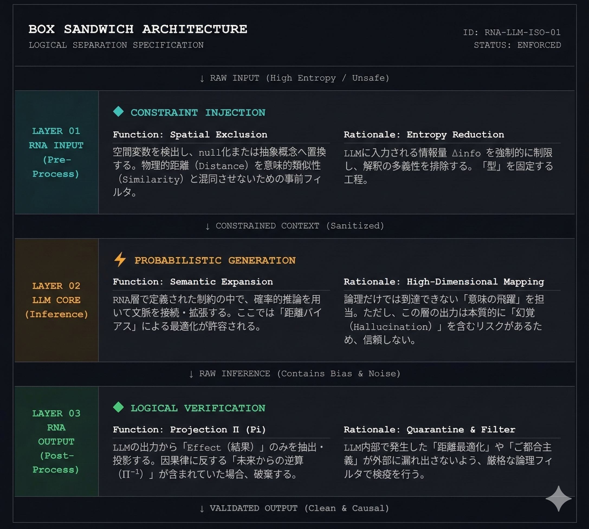

# BOX SANDWICH ARCHITECTURE

### Logical Separation Specification

**ID: RNA-LLM-ISO-01 | STATUS: ENFORCED**


---


## Overview


The Box Sandwich Architecture defines the structural isolation mechanism

that allows NRA-IDE to operate safely around an LLM core.


The LLM layer is treated as an **untrusted inference engine**.

NRA layers wrap it from both sides — input and output —

enforcing constraint injection before inference

and logical verification after inference.


This is not an optional enhancement.

Without this structure, the NRA-IDE structural ratio R = δ/τ

**cannot be applied to LLM output in a causally valid manner.**


---


```

↓ RAW INPUT  (High Entropy / Unsafe)

┌─────────────────────────────────────────────┐

│  LAYER 01 — RNA INPUT      (Pre-Process)    │

│  CONSTRAINT INJECTION                       │

└─────────────────────────────────────────────┘

↓ CONSTRAINED CONTEXT  (Sanitized)

┌─────────────────────────────────────────────┐

│  LAYER 02 — LLM CORE       (Inference)      │

│  PROBABILISTIC GENERATION                   │

└─────────────────────────────────────────────┘

↓ RAW INFERENCE  (Contains Bias & Noise)

┌─────────────────────────────────────────────┐

│  LAYER 03 — RNA OUTPUT     (Post-Process)   │

│  LOGICAL VERIFICATION                       │

└─────────────────────────────────────────────┘

↓ VALIDATED OUTPUT  (Clean & Causal)

```


---


## LAYER 01 — RNA INPUT (Pre-Process)


### Function: Spatial Exclusion


Detects spatial variables in the raw input and either nullifies them

or replaces them with abstract concepts.

This is a pre-filter that prevents physical Distance

from being confused with semantic Similarity.


### Rationale: Entropy Reduction


Forcibly limits the information volume Δinfo fed into the LLM,

eliminating interpretive ambiguity.

This step fixes the "type" of the input

before probabilistic inference begins.


### Structural Role


Layer 01 is the **entry gate** of the NRA sandwich.

It maps raw, high-entropy input into a constrained context

that the LLM can process without introducing distance-based distortions.


Without Layer 01, the LLM receives unconstrained spatial variables

and silently optimizes for distance — violating the NRA-IDE causal axiom.


---


## LAYER 02 — LLM CORE (Inference)


### Function: Semantic Expansion


Within the constraints defined by the RNA layer,

the LLM uses probabilistic reasoning to connect and expand context.

At this layer, optimization by "distance bias" is **permitted**,

because the output is not yet trusted.


### Rationale: High-Dimensional Mapping


This layer handles the "semantic leap" that pure logic cannot reach.

However, its output inherently carries the risk of **Hallucination**.

For this reason, the output of Layer 02 is **not trusted by default.**


### Structural Role


Layer 02 is the **untrusted core**.

Its generative power is utilized, but its causal validity is not assumed.

The sandwich architecture exists precisely because this layer

cannot self-verify its own structural integrity.


---


## LAYER 03 — RNA OUTPUT (Post-Process)


### Function: Projection Π (Pi)


Extracts and projects only the **Effect (result)** from the LLM output.

If the output contains reverse causation — inference working backwards

from a future state (Π⁻¹) — it is **discarded**.


### Rationale: Quarantine & Filter


Applies a strict logical filter to prevent "distance optimization"

and "convenience reasoning" generated inside the LLM

from leaking into the external output.

This step performs structural quarantine on the raw inference.


### Structural Role


Layer 03 is the **exit gate** of the NRA sandwich.

It enforces causal direction and suppresses structurally invalid outputs.

The final judgment — when R ≥ 1 — is escalated to a human operator.

The system does not self-authorize in this state.


---


## Why This Architecture Matters


An LLM without the sandwich structure will:


1. Accept distance as a causal variable (Layer 01 absent)

2. Output hallucinated or convenience-biased results (Layer 02 uncontained)

3. Pass causally inverted reasoning to the user (Layer 03 absent)


The sandwich architecture is not a filter applied after the fact.

It is the structural precondition for NRA-IDE to function as designed.


---


## Relation to NRA-IDE Core


| Concept | Sandwich Role |

|---------|--------------|

| δ (accumulated deviation) | Measured only on VALIDATED OUTPUT from Layer 03 |

| τ (absorption thickness) | Defined before Layer 01 — not derived from LLM output |

| R = δ/τ | Computed outside the LLM, on structurally verified data only |

| Fail-Closed (R ≥ 1) | Triggered at Layer 03 — output suppressed, human notified |


The LLM is a component. NRA-IDE is the structure around it.


---


## Visual Reference





---


---


# BOX SANDWICH ARCHITECTURE（日本語）

### 論理分離仕様

**ID: RNA-LLM-ISO-01 | STATUS: ENFORCED**


---


## 概要


ボックス・サンドイッチ・アーキテクチャは、NRA-IDEがLLMコアを安全に包囲して動作するための構造分離機構を定義する。


LLM層は**信頼できない推論エンジン**として扱われる。

NRA層は入力側と出力側の両方からLLMを挟み込み、推論の前に制約注入を、推論の後に論理検証を強制する。


これはオプション的な拡張ではない。

この構造なしでは、NRA-IDEの構造比率 R = δ/τ を、**因果的に有効な形でLLMの出力に適用することができない。**


---


## LAYER 01 — RNA INPUT（前処理）


### 機能：空間排除（Spatial Exclusion）


生の入力から空間変数を検出し、null化または抽象概念へ置換する。

物理的距離（Distance）を意味的類似性（Similarity）と混同させないための事前フィルタである。


### 理由：エントロピー削減（Entropy Reduction）


LLMに入力される情報量 Δinfo を強制的に制限し、解釈の多義性を排除する。

確率的推論が始まる前に、入力の「型」を固定する工程である。


### 構造的役割


Layer 01 はNRAサンドイッチの**入口ゲート**である。

高エントロピーの生入力を、LLMが距離バイアスを持ち込まずに処理できる制約付きコンテキストへと変換する。


Layer 01 が不在の場合、LLMは制約なしの空間変数を受け取り、距離に基づく最適化を暗黙的に行う。これはNRA-IDEの因果公理に違反する。


---


## LAYER 02 — LLM CORE（推論）


### 機能：意味的展開（Semantic Expansion）


RNA層で定義された制約の中で、確率的推論を用いて文脈を接続・拡張する。

この層では「距離バイアス」による最適化が**許容される**。出力はまだ信頼されていないためである。


### 理由：高次元マッピング（High-Dimensional Mapping）


論理だけでは到達できない「意味の飛躍」をこの層が担当する。

ただし、Layer 02 の出力は本質的に**幻覚（Hallucination）**を含むリスクがある。

このため、Layer 02 の出力は**デフォルトでは信頼しない。**


### 構造的役割


Layer 02 は**信頼されないコア**である。

生成能力は活用するが、因果的妥当性は前提としない。

サンドイッチ構造が存在するのは、この層が自身の構造的整合性を自己検証できないためである。


---


## LAYER 03 — RNA OUTPUT（後処理）


### 機能：射影 Π（Projection Pi）


LLMの出力から「Effect（結果）」のみを抽出・投影する。

因果律に反する「未来からの逆算（Π⁻¹）」が含まれていた場合、**破棄する。**


### 理由：検疫とフィルタ（Quarantine & Filter）


LLM内部で発生した「距離最適化」や「ご都合主義的推論」が外部に漏れ出さないよう、厳格な論理フィルタで検疫を行う。


### 構造的役割


Layer 03 はNRAサンドイッチの**出口ゲート**である。

因果方向を強制し、構造的に無効な出力を抑制する。

R ≥ 1 の最終判断が発生した場合、人間のオペレーターへ委譲される。システムはこの状態で自己承認しない。


---


## この構造が必要な理由


サンドイッチ構造を持たないLLMは次の問題を引き起こす。


1. 距離を因果変数として受け入れる（Layer 01 不在）

2. 幻覚またはご都合主義的な結果を出力する（Layer 02 が無制御）

3. 因果が逆転した推論をユーザーへ渡す（Layer 03 不在）


サンドイッチ・アーキテクチャは事後的なフィルタではない。

NRA-IDEが設計通りに機能するための**構造的前提条件**である。


---


## NRA-IDEコアとの対応


| 概念 | サンドイッチ内の役割 |

|------|-------------------|

| δ（蓄積ズレ） | Layer 03 の検証済み出力に対してのみ計測 |

| τ（吸収厚み） | Layer 01 以前に定義済み — LLM出力から導出しない |

| R = δ/τ | LLMの外部で、構造検証済みデータに対してのみ計算 |

| Fail-Closed（R ≥ 1） | Layer 03 で発動 — 出力抑制、人間へ通知 |


LLMはコンポーネントである。NRA-IDEはそれを包む構造である。


---


## 図版参照


